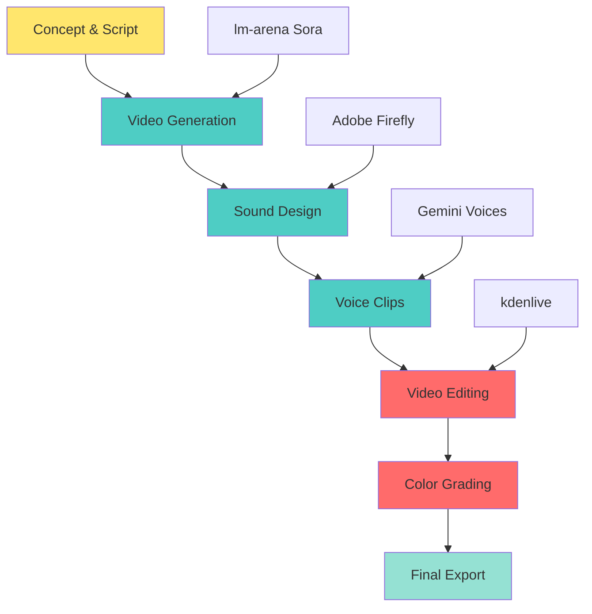

# Murder Mystery Video Pipeline: From Concept to Final Cut

**Part of the [Murder Mystery 1926](/projects/artifactum/murder-mystery-1926/) project**

---

## The Goal

**What I needed:** 30-second teaser video for a murder mystery game.

**Requirements:**
- 1920s aesthetic
- Noir atmosphere
- Professional enough to hype people
- Done in 2 weeks
- Budget: limited but real

**My experience with video production:** Zero.

**My advantages:**
- AI tools exist
- I can follow tutorials
- I have Nobody to ask when stuck
- Hyperfocus mode activated

---

## The Pipeline Overview



**Total workflow time:** ~4 days of active work (spread over 1 week)

---

## Stage 1: Concept & Script

### What I Started With

**The game concept:**
- Murder mystery roleplay
- 1920s Manhattan setting
- 11 characters
- Christmas dinner party
- December 25, 2025 event

**Teaser goal:** Get people excited. Build mystery. Show aesthetic.

---

### The Script

**Duration:** 30 seconds

**Structure:**
1. Opening shot (2-3s): Noir establishing
2. Clues montage (15-20s): Quick cuts of murder evidence
3. Title reveal (3-5s): Game title and date
4. End (2s): Call to action or mysterious close

**Tone:** Dark. Mysterious. Classy. 1920s glamour meets murder.

---

### The Shot List

**What I needed to generate:**

**Opening:**
- Noir cityscape or interior establishing shot

**Clues:**
- Piano wire (murder weapon)
- Wine glass (poison implication)
- Broken pearl necklace (struggle)
- Blood spatter on wood
- Handwritten note (clue)

**Each shot:** 3-6 seconds, macro close-ups, dramatic lighting

**Why macro?** Easier for AI to generate. Fewer elements = fewer things to mess up.

---

## Stage 2: Video Generation

### Tool Selection

**Why lm-arena (not Fal.ai):**
- Side-by-side model comparison
- Better Sora results (somehow)
- More efficient iteration
- Full explanation in [this post](/posts/2024-10-16-lm-arena-beats-falai-sora/)

---

### The Generation Strategy

**1. Write detailed prompts**

**Example (piano wire shot):**
```
Extreme macro close-up, broken piano wire approximately 30cm length
coiled on dark wood surface (mahogany desk), wire diameter 0.8mm
visible in sharp detail, dark brownish-red stains on sections of wire
(dried blood implication), one end shows clean break with metal fiber
separation visible, wire casts dramatic shadow from single key light
above left, camera slow rotation orbit 270 degrees around wire over
6 seconds revealing different angles and stain patterns, shot with
100mm macro lens f/2.0, ultra-sharp focus showing steel wire texture,
color grading dark noir with cool blue tones, 8K macro, unsettling
```

**Why so detailed?**
- Specific camera parameters (lens, f-stop)
- Lighting direction (key light above left)
- Movement description (270-degree rotation)
- Color grading intent (noir, cool blue tones)
- Technical specs (8K, macro)

**AI needs ALL of this** to get close to your vision.

---

**2. Generate with multiple models simultaneously**

**Models tested:**
- Sora (usually winner)
- Kling (sometimes surprising)
- Runway (hit or miss)
- Minimax (rarely worked for this aesthetic)

**Process:**
- Same prompt → all models
- Generate
- Compare side-by-side
- Vote on lm-arena (best result)
- Download winner

**Time per iteration:** ~2-5 minutes

---

**3. Parallel generation across accounts**

**The hack:** Multiple Discord accounts (friends' permission).

**Why:**
- Bypass rate limits
- Test prompt variations simultaneously
- Faster iteration cycle

**Ethical note:** Check platform ToS. Use responsibly.

---

**4. Generate extras**

**For each shot:**
- Generated: 3-5 variations
- Usable: 1-2
- Actually used: 1

**Total clips generated:** 20+

**Total clips in final video:** 5

**Waste?** No. Options are valuable.

---

### What Worked

✅ **Sora for cinematic shots**
- Best at noir aesthetic
- Best at realistic materials
- Best camera movement understanding

✅ **Detailed prompts**
- Technical parameters = better results
- Specific lighting = more control
- Movement description = coherent motion

✅ **Iterative refinement**
- Generated → evaluated → adjusted prompt → regenerated
- Learning which phrases work for which models

---

### What Didn't Work

❌ **Wide shots**
- Too many elements for AI to get right
- Easier to mess up

❌ **Character shots**
- Faces are hard
- Hands are harder
- Full body = nightmare

❌ **Complex motion**
- Simple movements only
- Camera orbits work
- Character action = chaos

**Solution:** Stuck to macro close-ups of props. Safer. Faster. Better results.

---

## Stage 3: Sound Design

### Tool: Adobe Firefly

**Why Firefly:**
- Generates professional SFX
- Text-to-audio
- Quick iterations
- Royalty-free

---

### The SFX List

**What I needed:**
- Door creaking (ominous)
- Wine glass clinking (delicate)
- Footsteps on wood (tense)
- String music sting (dramatic reveal)
- Ambient room tone (1920s interior)

---

### The Process

**1. Write descriptive prompts**

**Example:**
```
Heavy wooden door slowly creaking open in quiet mansion,
old hinges slightly rusty, ominous and tense atmosphere,
realistic wood and metal sound, 1920s period appropriate
```

**2. Generate multiple variations**

Adobe Firefly gives you 3-4 variations per prompt.

**3. Pick the best one**

Listen to all. Download winner. Move on.

**Success rate:** ~70% (pretty good!)

---

### What Worked

✅ **Short, specific sounds**
- Door creak ✅
- Glass clink ✅
- Footsteps ✅

✅ **Period-appropriate requests**
- "1920s" in prompt = better aesthetic fit
- "Vintage" = helps with tone

✅ **Atmospheric sounds**
- Room tone, ambient noise, subtle textures

---

### What Didn't Work

❌ **Complex layered sounds**
- Multiple elements = confusion
- Better to generate separately and layer in editing

❌ **Music**
- Short stings work
- Full compositions = hit or miss
- Better to use royalty-free music libraries

**Solution:** Use Firefly for SFX only. Find music elsewhere.

---

## Stage 4: Voice Clips

### Tool: Gemini Voice Generation

**Why Gemini:**
- Natural-sounding voices
- Multiple accents/tones
- Fast generation
- Free tier available

---

### What I Needed

**Voice clips for teaser:**
- Mysterious narration (short phrases)
- Character line snippets (1-2 seconds each)
- Ambient dialogue (background atmosphere)

---

### The Process

**1. Write the script**

**Example:**
```
"December 25, 1926. A Christmas dinner. A perfect crime."
```

**2. Specify voice parameters**

- Gender
- Age range
- Accent (Transatlantic for 1920s)
- Tone (mysterious, sultry, ominous)

**3. Generate multiple takes**

**4. Pick the best one**

---

### What Worked

✅ **Short phrases**
- 1-2 sentences = good quality
- Longer = more likely to sound off

✅ **Clear direction**
- "1920s femme fatale, mysterious and sultry"
- Specific = better results

✅ **Multiple generations**
- Not every take is usable
- Generate 3-5, pick the best

---

### What Didn't Work

❌ **Accents are unpredictable**
- Requested Transatlantic, got Australian (???)
- Hard to control consistently

❌ **Long passages**
- Quality degrades
- Pacing gets weird
- Better to do short clips and edit together

❌ **Emotional nuance**
- AI voices struggle with subtlety
- Over-the-top or flat, rarely in-between

**Solution:** Keep clips short. Use sparingly. Heavy reverb helps hide imperfections.

---

## Stage 5: Video Editing

### Tool: kdenlive

**Why kdenlive:**
- Free and open-source
- Powerful enough for this project
- Linux-friendly
- Decent learning curve

**Why NOT Premiere Pro:** Expensive. Didn't want subscription.

**Why NOT DaVinci Resolve:** Tried it. Too complex for my needs.

---

### The Timeline

**Track structure:**
```
Track 5: Title text overlay
Track 4: Sound effects (glass, door, footsteps)
Track 3: Voices (narration, dialogue)
Track 2: Background music
Track 1: Video clips
```

**Why this order:** Easier to adjust layers independently.

---

### The Editing Process

**1. Import all assets**
- Video clips (from lm-arena)
- SFX (from Firefly)
- Voice clips (from Gemini)
- Music (royalty-free)

**2. Rough cut**
- Drag video clips to timeline
- Order by shot list
- Trim to rough length

**3. Add transitions**
- Kept simple (fade in/out)
- No fancy effects (don't distract from content)

**4. Layer in sound**
- Background music first (sets mood)
- SFX second (sync to video)
- Voice clips last (sync to cuts)

**5. Adjust timing**
- Fine-tune cuts
- Match audio to visual beats
- Test pacing (too fast? too slow?)

**6. Color grading (basic)**
- Adjust contrast (noir look)
- Cool blue tones (mystery vibe)
- Consistent across all clips

**7. Export**
- Format: MP4 (H.264)
- Resolution: 1080p
- Bitrate: High quality
- Audio: AAC, 192kbps

---

### kdenlive Tips for Beginners

**Keyboard shortcuts I learned:**
- `S` = Split clip at playhead
- `Space` = Play/pause
- `I` = Set in point
- `O` = Set out point
- `Ctrl+Z` = Undo (your best friend)

**Mistakes I made:**
- Not saving frequently (kdenlive crashed twice)
- Not using proxy clips (preview lag on big files)
- Over-complicating transitions (simple is better)

**What I wish I'd known:**
- Nest clips into compound clips (cleaner timeline)
- Use color scopes for consistent grading
- Export in smaller chunks for testing

---

## Stage 6: Iteration & Polish

### The Feedback Loop

**1. Export draft**

**2. Watch it (multiple times)**
- On different devices
- With and without sound
- At different volumes

**3. Note what's off**
- Pacing issues
- Audio sync problems
- Color inconsistency
- Transitions that feel jarring

**4. Go back to kdenlive**

**5. Fix issues**

**6. Export again**

**7. Repeat until satisfied**

**Total iterations:** 5 versions before final

---

### What I Adjusted Between Versions

**Version 1 → 2:**
- Slowed down opening (too fast)
- Added fade-in for music
- Increased SFX volume

**Version 2 → 3:**
- Cut 2 clips that didn't fit aesthetic
- Adjusted color grading (too blue)
- Shortened overall length (35s → 30s)

**Version 3 → 4:**
- Re-synced voice clip (was off by 0.3s)
- Added room tone (filled dead air)
- Smoothed transitions

**Version 4 → 5:**
- Final polish
- Exported in multiple formats (web, full quality)
- Created thumbnail frame

---

## The Final Workflow (Actual Times)

**Day 1: Video generation**
- 4 hours active work
- 20+ clips generated
- 5 clips selected

**Day 2: Sound design**
- 2 hours for SFX
- 1 hour for voice clips
- 30 mins finding music

**Day 3: Editing (rough cut)**
- 3 hours learning kdenlive
- 2 hours actual editing
- 1 draft version

**Day 4: Polish & iterations**
- 4 hours refining
- 5 versions total
- Final export

**Total active work:** ~17 hours

**Spread over:** 1 week (not consecutive days)

---

## Tools Cost Breakdown

**lm-arena:** Free tier + voting credits = $0

**Adobe Firefly:** Subscription I already had = $0 incremental

**Gemini:** Free tier = $0

**kdenlive:** Open-source = $0

**Music:** Royalty-free library = $0

**Total cost for this project:** $0

*(I'd already spent money on Fal.ai earlier, but didn't use those clips in final video)*

---

## What I Learned

### 1. AI handles individual assets better than full videos

**Good workflow:**
- Generate individual clips (AI)
- Generate individual sounds (AI)
- Assemble manually (human)

**Bad workflow:**
- "AI, make me a 30-second video" (chaos)

---

### 2. Editing is where the magic happens

**AI gives you:** Raw materials

**You create:** The story, pacing, emotion

**The edit is what makes it feel professional.**

---

### 3. Simple is better

**Fancy transitions?** Distract from content.

**Complex motion?** Hard for AI, hard to edit.

**Lots of effects?** Looks amateur.

**Solution:** Clean cuts, simple fades, focus on content.

---

### 4. Sound design is 50% of the experience

**Test:**
- Watch your video with sound: Feels complete
- Watch it muted: Feels empty

**Invest time in:**
- SFX that match visual beats
- Music that sets the mood
- Room tone to fill silence
- Audio levels that don't jar

---

### 5. Iterate. Then iterate more.

**Your first cut will not be your final cut.**

**Mine:**
- Version 1: Too long, too fast, weird pacing
- Version 5: Actually good

**Expect to refine.** Multiple times. It's normal.

---

## For Other Beginners

**If you're making your first AI-assisted video:**

### Start Small
- 15-30 seconds max
- Simple concept
- Macro shots (easier for AI)
- Limited number of clips (5-7)

### Use Free Tools
- lm-arena for video generation
- Firefly for SFX (free tier)
- Gemini for voices (free tier)
- kdenlive for editing (open-source)

### Generate Extras
- 3-5 versions of each shot
- You'll need options when editing

### Keep It Simple
- Clean cuts
- Simple transitions
- Focus on content, not effects

### Iterate
- First cut will be rough
- Refine 3-5 times
- Get feedback if possible

### Learn the Tools
- YouTube tutorials for kdenlive
- Practice with test projects first
- Keyboard shortcuts save time

---

## The Final Product

**30-second teaser video for Murder Mystery 1926.**

**Watch it:** [Murder Mystery project page](/projects/artifactum/murder-mystery-1926/)

**Stats:**
- Video clips: 5
- SFX layers: 7
- Voice clips: 2
- Music track: 1
- Total timeline tracks: 5
- Total iterations: 5 versions
- Time investment: ~17 hours
- Cost: $0

**Feelings:**
- Proud? Yes
- Exhausted? Also yes
- Would I do it again? Absolutely

---

**Part of the [Artifactum](/projects/artifactum/) series** - Murder mysteries built with AI assistance.

**Related posts:**
- [Why lm-arena beats Fal.ai](/posts/2024-10-16-lm-arena-beats-falai-sora/)
- [Murder Mystery Bloopers](/posts/2024-10-17-murder-mystery-bloopers/)
- [11 Characters, One Murder](/posts/2024-10-15-11-characters-one-murder/)

---

**Tools used:**
- **[lm-arena.ai](https://lmarena.ai/)** - Video generation
- **Adobe Firefly** - Sound effects
- **Gemini** - Voice generation
- **kdenlive** - Video editing
- **Nobody** - Technical guidance when stuck 💙

**Making your own AI video?** Questions? [Let me know!](#) I'm happy to help. 🎬
