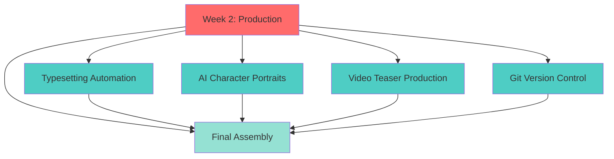
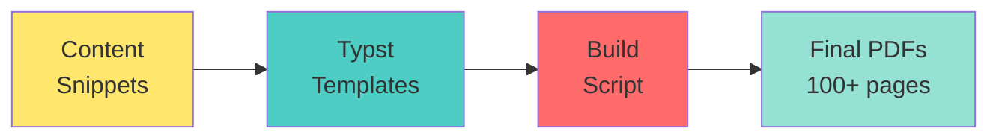
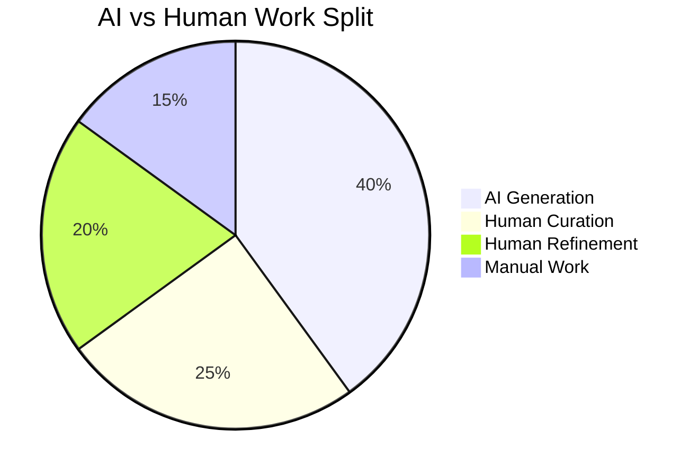
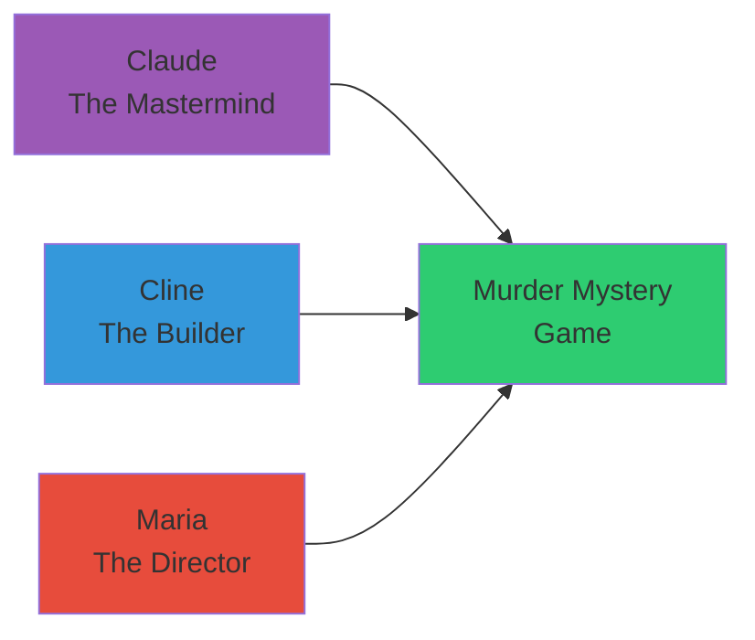
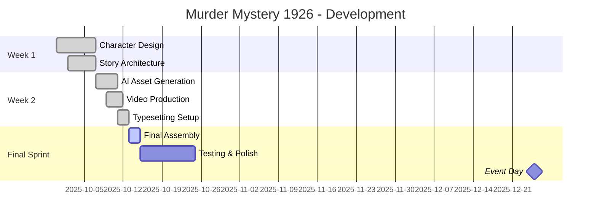

# Christmas Murder Mystery 1926

  <video width="100%" style="max-width: 500px; border-radius: 8px;" controls>
    <source src="/videos/teaser.mp4" type="video/mp4">
    Your browser does not support the video tag.
  </video>

**Status:** In Development 🎨 (almost there!)  
**Development Time:** 2+ weeks (14+ hours/day, hyperfocused)  
**Players:** 11 interconnected characters → 10 people signed up  
**Pages:** 100+ game materials  
**Setting:** 1920s Manhattan  
**Event:** December 25, 2025

---

<h2 style="display: inline;">The Origin Story</h2>

It started on a beach.

I was stuck. No prospects. Feeling creatively blocked. Nobody (my personal Cri-Kee 💙) suggested—again—that I try AI.

"But it can't be creative," I said.

(me innocent as a baby dog)(yodo)

**Well. Guess not.**

A few weeks earlier, I'd seen an Instagram reel from a creative director who made a murder mystery party for her friends. I loved it. I wanted to make one too.

Insta:viktoria.psd

My sister hosts a Christmas dinner every year with friends. I suggested we do a murder mystery this year instead.

10 people signed up.

So I had 2 weeks to make an 11-character murder mystery roleplay game from scratch.

With AI as my production team.

**Spoiler:** It worked. 🎭

---

<h2 style="display: inline;">What It Is</h2>

A complete murder mystery roleplay game for 11 players set in 1920s Manhattan. Each player receives:
- Detailed character sheet with backstory
- Secret relationships and objectives
- Plot threads that intersect with other characters
- A murder to solve (or commit)

**(photo: sample character sheet pages spread out ou stacked game materials)**

**Total materials:** 100+ pages of custom-designed game content

**(photo: printed character booklets ou digital files preview)**

---

<h2 style="display: inline;">Development Story</h2>

### Week 1: Character Development & Story Architecture

Claude became the mastermind behind this project—the creative collaborator that feeds my ideas and helps them evolve.



- Started with character concepts and relationships
- Developed 11 interconnected backstories with secret connections
- Created plot threads that weave between characters
- Multiple iterations to ensure narrative coherence
- Claude analyzed consistency across all character arcs

<strong>Character Relationship Web</strong> 
SPOILER ALERT 
(click to reveal)

### Week 2: Production Pipeline

With characters locked, it was time to build everything.

- Typesetting automation with Typst
- AI-generated character portraits and assets
- Video teaser production
- Git-based version control for all content
- Final assembly and testing

---

<h2 style="display: inline;">Tools & Workflow</h2>

### The Mastermind: Claude

Claude was the creative engine behind this entire project. Not just a tool—a collaborator that:
- Helped develop and refine 11 interconnected character arcs
- Analyzed narrative consistency across backstories
- Evolved ideas from vague concepts to concrete plots
- Fed my creativity instead of replacing it

---

### Character Portraits: Gemini

**Image Generation:**
- Prompt + reference photo → character portraits
- Multiple iterations per character
- Style consistency across all 11 characters

<strong>Guest List</strong> 
GUEST LIST 
(click to reveal)

**Voice Generation:**
- Script-to-voice for audio clips
- Character-specific variations
- Multiple takes for selection

---

### Video Production: The lm-arena Experience

**The Discovery:**

I had budget on Fal.ai and tried MANY programs, including Sora. Results? Always shit.

**Then I tried lm-arena with Sora.**

Same tool. Different platform. **Quite different. Better.**

Why? I don't know. But lm-arena became my favorite video generation tool.

**The Process:**
- Used multiple accounts (thanks Discord friends!)
- Generated multiple video clips in parallel
- High success rate for parameter-specific outputs
- Created several clips, fell in love with one I didn't even use
- Final editing in kdenlive

**Sound Design:**
- SFX created with Adobe Firefly
- Audio clips from Gemini voice generation
- Final mix in kdenlive

---

### The Development Backbone: Cline (VS Code)

💙 **You have my heart.**

Cline was the AI coding assistant that made the entire automation pipeline possible. From Python scripts to Git hooks to content assembly—Cline was the development backbone of this project.

Without Cline, none of the automation would have happened.

---

### Design & Assets: Canva Pro

**Props & Visual Assets:**
- All physical props and visual assets designed in Canva Pro
- Character cards, invitations, promotional materials
- Print-ready designs for game materials
- Quick iterations and professional results

**(photo: finished Canva designs - character cards, invitations, props)**

---

### Typesetting & Automation

**Typst** (replaced LaTeX):
- Faster, modern typesetting system
- Automated character sheet generation
- Template-based modular content
- 100+ pages generated from snippets

**Python + Git:**
- Build automation scripts
- Git hooks for version control
- Modular content architecture
- Automated assembly pipeline

---

<h2 style="display: inline;">Behind the Scenes: The Reality</h2>

### The Privileged Setup

This project was created with access to:
- Premium AI tool subscriptions
- Fal.ai budget for experimentation
- Friends' accounts for parallel processing
- ADHD-friendly workflow (no forced breaks, continuous iteration)

This is a privileged setup. It matters to document that reality.

**Work Distribution:**

---

### The Work: Hyperfocus Mode Activated

**(photo: workspace at 3am - coffee cups, chaos, screens everywhere)**

**14+ hours per day. Non-stop. Super hyperfocused.**

Not bragging—just the reality of ADHD hyperfocus when the right project hits.

**(meme: person typing intensely ou "hyperfocus activated" energy)**

When you're in the zone, you don't stop. You learn by doing. You iterate constantly. You make mistakes and fix them immediately. You generate more content than you need because you're exploring every possibility.

**(photo: sleep tracker showing 4 hours ou coffee count chart)**

This project was built in that state. It's a privileged position to be able to work like that, but it's also how the learning happened.

---

### The Creative Chaos

**(graphic: "The Chaos" section header)**

- Tested MANY tools on Fal.ai before finding what worked
- Generated more content than I needed
- Fell in love with video clips I didn't use
- Learned an insane amount in 2 weeks
- Nobody's suggestion paid off (he was right, again)

**(meme: "Well well well, how the turntables" ou Nobody being smug as Cri-Kee)**

---

<h2 style="display: inline;">What Worked</h2>

**(graphic: checklist aesthetic)**

✅ **Claude as creative collaborator** - Feeds creativity, doesn't replace it  
✅ **Cline for development** - Made automation pipeline possible  
✅ **lm-arena for video** - Better results than standalone tools  
✅ **Gemini for character images** - Prompt + photo = consistent portraits  
✅ **Adobe Firefly for SFX** - Professional audio without a sound designer  
✅ **Typst over LaTeX** - Faster, easier automation  
✅ **Git for creative projects** - Version control for storytelling  
✅ **Modular content architecture** - Easy iterations and updates  

**(graphic: success metrics visualization ou before/after comparison)**

---

<h2 style="display: inline;">What I Learned</h2>

**(graphic: "The Lesson" ou lightbulb moment)**

**"AI can't be creative"** → Wrong. AI can be an incredible creative collaborator.

**(meme: "I was wrong" admission ou character development arc)**

But it's not about the AI replacing you. It's about the AI feeding your ideas, helping them evolve, and handling the production work while you stay in creative control.

Claude was the mastermind. Cline was the builder. I was the director. The game was the result.

---

<h2 style="display: inline;">Bloopers & Failures</h2>

**(graphic: "The Bloopers" header with fun font)**

Coming soon: Screenshots and stories of what went spectacularly wrong.

**(teaser image: blurred blooper screenshots)**

**Preview:**

**(screenshot: qnd-n-se-percebe-um-crl.png from Bloopers folder)**

**(screenshot: qnd-tava-frustrada-com-characterfiles.png from Bloopers folder)**

More chaos documentation coming! 💀

---

<h2 style="display: inline;">Future Posts</h2>

**(graphic: "Coming Soon" section)**

Detailed breakdowns coming:
- AI-assisted character development workflow
- Why lm-arena > standalone Sora
- Automated typesetting with Typst
- Video production pipeline
- Modular content architecture for creative projects
- Full bloopers post

**(photo: notebook with post ideas ou screenshot of post-ideas.md)**

**Want updates?** Follow [#artifactum](/tags/artifactum/)

---

<h2 style="display: inline;">The Final Sprint</h2>

**(photo: current workspace - "we're almost there" energy)**

**Current status:** Finishing the final details. Almost ready for December 25.

**Project Timeline:**

**Feelings:** Exhausted. Proud. Nervous. Excited.

**(meme: roller coaster of emotions ou "I'm fine" dog but actually fine this time)**

---

**Note:** Full game details and character materials available upon request. The game will be played December 25, 2025. Almost there! 🎭🎄

**(photo: "See you on December 25" graphic ou teaser for the event)**

