# Building Dominated by Cline

## From "I Don't Understand Shit" to Actually Shipping It

This is the meta-documentation of building the very site you're reading right now. A journey from Squarespace frustration to Hugo deployment, powered by AI assistance and stubborn determination.

**The Honest Truth:** I started knowing almost nothing about Hugo, static site generators, or how GitHub Pages actually works. But this site exists, it's live, and it's custom-built.

Here's how that happened.

---

<details>
<summary><h1 style="font-size: 1.5rem;">📖 The Journey</h1></summary>

<details>
<summary><h2 class="inline-heading">The Problem</h2></summary>

**What I wanted:**
- A personal portfolio/blog site
- Clean, minimal design
- Fast and lightweight
- Complete creative control
- Ability to document my AI projects

**What I tried first:**
- Squarespace (too limiting, felt like fighting the platform)
- Various website builders (same problem)
- Looking at Hugo themes (looked cool but... how does this actually work?)

**The realization:** I wanted something cooler than drag-and-drop builders, but I had no idea what I was doing.

</details>

---

<details>
<summary><h2 class="inline-heading">What Is Hugo? (Explained Like I Wish Someone Had)</h2></summary>

**Hugo is a static site generator.**

What that actually means:
- You write content in Markdown files (like a fancy text document)
- Hugo converts those into HTML (the actual website)
- You deploy the HTML files to GitHub Pages (free hosting)
- No database, no backend, just files

**Why this is better than Squarespace:**
- Complete control over everything
- Free hosting on GitHub
- Fast as hell (no server processing)
- Version control with Git (undo anything, track all changes)
- Markdown writing (clean, portable, AI-friendly)

**Why this is harder than Squarespace:**
- You need to understand file structure
- You need to use the command line
- You need Git and GitHub
- You need to customize themes
- There's no visual drag-and-drop

**The tradeoff:** More initial setup time, but way more power and flexibility.

</details>

---

<details>
<summary><h2 class="inline-heading">The Journey: Less Than a Week</h2></summary>

**Real timeline:** ~5 days from "What is Hugo?" to site live online.

**How I actually learned:**

**Day 1-2: Setup & Confusion**
- Installed Hugo (`sudo apt install hugo`)
- Found the Archie theme (minimal, clean, exactly what I wanted)
- Tried to follow installation docs (got completely lost)
- Asked Claude to explain Hugo in simple terms
- Created first post (didn't show up)
- Claude explained front matter to me
- Finally got a post to appear!

**Day 3-4: Git, GitHub Pages, and Many Errors**
- Created repo `dominatedbycline.github.io` 
- Pushed code (site didn't appear)
- Claude helped me understand the build process
- Learned you need to run `hugo` to generate the site
- Pushed again (still broken)
- Claude explained GitHub Pages needs the `public/` folder
- Site went live! (then I broke it adding features)
- Claude helped me fix it multiple times

**Day 5-6: Customization (with a LOT of Claude's help)**
- Wanted to add Mermaid diagrams → Claude wrote the integration
- Wanted image carousel → Claude built the shortcode
- Wanted custom CSS → Claude showed me how to override theme styles
- Wanted hot pink accents → Claude helped with CSS
- Broke navigation twice → Claude fixed it both times

**What I actually did vs. what Claude did:**
- **Claude:** Wrote most of the code, explained concepts, debugged errors
- **Me:** Decided what I wanted, tested features, wrote content, learned by watching Claude work

**The honest truth:** Without Claude, this would have taken weeks or months. With Claude, it took days.

</details>

---

<details>
<summary><h2 class="inline-heading">The AI Collaboration Part</h2></summary>

### How AI (Cline) Made This Possible

**Here's the truth:** I couldn't have built this alone in a reasonable timeframe.

**What Cline did:**
- Explained Hugo's directory structure clearly
- Created custom layouts when I described what I wanted
- Debugged broken builds (SO MANY broken builds)
- Set up Mermaid integration
- Built the carousel component
- Helped me understand Git workflows

**What I did:**
- Made all creative decisions
- Wrote all content
- Chose the theme and design direction
- Learned by doing (with AI as a guide)
- Debugged issues myself when possible

**The workflow:**
- Me: "I want to add a carousel for project images"
- Cline: *creates shortcode, explains how to use it, adds example*
- Me: *tests it, tweaks the styling, learns how shortcodes work*
- Result: I can now create shortcodes myself

**This is different from using a website builder:**
- With Squarespace, you're limited to what the platform allows
- With Hugo + AI, you learn the system and can do anything
- The AI doesn't replace understanding—it accelerates it

</details>

---

<details>
<summary><h2 class="inline-heading">What I Learned (Technical Skills)</h2></summary>

### Hugo Concepts

**Front Matter:** The `---` section at the top of Markdown files containing metadata
```yaml
---
title: "Post Title"
date: 2025-01-15
draft: false
tags: ["tag1", "tag2"]
---
```

**Content Organization:**
- `content/posts/` for blog posts
- `content/projects/` for project pages
- `_index.md` creates section landing pages

**Layouts:**
- `baseof.html` is the base template (wraps everything)
- `single.html` for individual pages
- `list.html` for listing pages
- Partials in `layouts/partials/` for reusable components

**Shortcodes:**
- Custom HTML components you can embed in Markdown
- Example: `` for diagrams

### Git & GitHub Pages

**Git workflow:**
```bash
git add -A          # Stage all changes
git commit -m "..."  # Commit with message
git push origin main # Push to GitHub
```

**GitHub Pages:**
- Serves static files from your repo
- Can use GitHub Actions for auto-building
- Live at `username.github.io`

### Markdown Mastery

**What I use constantly:**
- Headers: `#`, `##`, `###`
- Links: `[text](url)`
- Images: ``
- Code blocks with syntax highlighting
- Lists and tables

</details>

---

<details>
<summary><h2 class="inline-heading">What I Learned (Meta Skills)</h2></summary>

### 1. Reading Documentation Doesn't Mean You Understand It

**The problem with docs:**
- They assume you know certain things
- They skip "obvious" steps (that aren't obvious)
- They don't explain *why*, just *how*

**What worked better:**
- Asking AI to explain concepts in simpler terms
- Trying things and breaking them (then fixing)
- Looking at working examples
- Building actual features instead of just reading

### 2. "I Don't Understand Shit" Is Temporary

**Week 1:** Complete confusion about Hugo structure  
**Week 2:** Starting to see patterns  
**Week 3:** Can troubleshoot most issues myself  
**Now:** Comfortable building new features

**The shift:** From "what is this magic" to "oh, that's just a template that loops through posts."

### 3. Time Investment vs. Capability Gained

**Squarespace:**
- Fast setup (30 minutes)
- Limited customization
- Monthly cost
- Can't do anything outside their system

**Hugo:**
- Slower setup (2-3 weeks to comfort)
- Unlimited customization
- Free hosting
- Complete control and transferable skills

**The verdict:** Hugo takes more time but gives you actual capabilities instead of just a website.

</details>

---

<details>
<summary><h2 class="inline-heading">The Tech Stack</h2></summary>

**What This Site Uses:**

- **Hugo:** Static site generator
- **Archie Theme:** Minimal, clean base theme
- **GitHub Pages:** Free hosting
- **Git:** Version control
- **Markdown:** Content writing format
- **Mermaid:** Diagram rendering
- **Custom CSS:** Design tweaks
- **Custom Shortcodes:** Reusable components

**Development Tools:**
- VS Code (editor)
- Terminal (command line work)
- Cline (AI coding assistant in VS Code)
- Git (version control)

</details>

---

<details>
<summary><h2 class="inline-heading">Common Problems I Hit (And How I Fixed Them)</h2></summary>

### "My post doesn't show up!"
**Cause:** `draft: true` in front matter  
**Fix:** Change to `draft: false`

### "Images won't load!"
**Cause:** Wrong path (relative vs absolute)  
**Fix:** Put images in `/static/images/`, reference as `/images/filename.jpg`

### "Site builds locally but breaks on GitHub Pages!"
**Cause:** Case-sensitive paths on Linux (GitHub) vs Mac/Windows  
**Fix:** Double-check all file paths for exact case

### "Custom CSS isn't applying!"
**Cause:** Hugo theme CSS loads first, needs override  
**Fix:** Use more specific CSS selectors or `!important` (sparingly)

### "Changes aren't showing after deployment!"
**Cause:** Browser cache  
**Fix:** Hard refresh (Ctrl+Shift+R) or wait a few minutes

</details>

---

<details>
<summary><h2 class="inline-heading">Project Structure (How It Actually Works)</h2></summary>

```
dominatedbycline/
├── content/              # All your content
│   ├── posts/           # Blog posts
│   ├── projects/        # Project pages
│   └── about.md         # About page
├── layouts/             # Custom templates (override theme)
│   ├── _default/        # Page templates
│   ├── partials/        # Reusable components
│   └── shortcodes/      # Custom shortcodes
├── static/              # Static files (images, videos)
│   ├── images/
│   └── videos/
├── themes/archie/       # The theme (don't edit directly)
├── hugo.toml            # Site configuration
└── public/              # Generated site (Git ignores this)
```

**How it flows:**
1. Write Markdown in `content/`
2. Hugo uses `layouts/` templates
3. Combines with theme from `themes/`
4. Pulls images from `static/`
5. Outputs HTML to `public/`
6. GitHub Pages serves `public/`

</details>

---

<details>
<summary><h2 class="inline-heading">What's Next</h2></summary>

**Features I want to add:**
- [ ] Search functionality
- [ ] Better mobile navigation
- [ ] Project filtering/tagging
- [ ] RSS feed optimization
- [ ] Analytics (privacy-friendly)
- [ ] Comments system (maybe)

**Skills I want to build:**
- [ ] Better CSS/design skills
- [ ] JavaScript for interactivity
- [ ] Performance optimization
- [ ] SEO improvements

</details>

</details>

---

<details>
<summary><h1 style="font-size: 1.5rem;">🔧 Technical Specifications</h1></summary>

<details>
<summary><h2 class="inline-heading">Hugo Fundamentals</h2></summary>

### How Hugo Actually Works

**The Build Process:**

Hugo is a **static site generator** - it takes your content (Markdown files) and templates (HTML layouts) and generates a complete static website.

```
┌─────────────┐       ┌─────────────┐       ┌─────────────┐
│   Content   │       │   Layouts   │       │   Static    │
│  (Markdown) │   +   │    (HTML)   │   =   │    Site     │
│             │       │             │       │   (HTML)    │
└─────────────┘       └─────────────┘       └─────────────┘
```

**Step-by-step:**

1. **You write** Markdown files in `content/`
2. **Hugo reads** the front matter (metadata at top of file)
3. **Hugo applies** the appropriate layout template from `layouts/` or `themes/`
4. **Hugo generates** HTML files in `public/`
5. **You deploy** the `public/` folder to a web server (e.g., GitHub Pages)

**Why it's fast:**
- No database queries
- No server-side processing
- Pure HTML files served directly
- Everything is pre-built

### Directory Structure Deep Dive

**Your Hugo site structure:**

```
your-site/
├── archetypes/       # Templates for new content
│   └── default.md
├── assets/           # Files to be processed (SCSS, JS)
│   └── css/
├── content/          # YOUR CONTENT (Markdown files)
│   ├── posts/        # Blog posts
│   ├── projects/     # Project pages
│   └── about.md      # Single pages
├── data/             # Data files (JSON, YAML, TOML)
├── layouts/          # YOUR CUSTOM TEMPLATES
│   ├── _default/     # Default templates
│   │   ├── baseof.html    # Base template (wraps everything)
│   │   ├── single.html    # Individual page template
│   │   └── list.html      # List page template
│   ├── partials/     # Reusable components
│   │   ├── head.html
│   │   ├── header.html
│   │   └── footer.html
│   └── shortcodes/   # Custom content snippets
│       └── mermaid.html
├── static/           # Static files (copied as-is)
│   ├── images/
│   ├── videos/
│   └── favicon.ico
├── themes/           # Theme files (don't edit directly!)
│   └── archie/
├── hugo.toml         # Site configuration
└── public/           # GENERATED SITE (don't edit!)
```

**Key folders explained:**

**`content/`** - Where you write
- Organize by section (`posts/`, `projects/`)
- File structure = URL structure
- `content/posts/my-post.md` → `/posts/my-post/`
- `_index.md` creates section landing pages

**`layouts/`** - How it looks
- Overrides theme templates
- Hugo looks here FIRST, then in `themes/`
- Use this to customize without editing theme

**`static/`** - Files copied directly
- No processing, just copied to `public/`
- Reference as `/images/photo.jpg` in your content

**`public/`** - Generated output
- **DO NOT EDIT** - regenerated every build
- This is what gets deployed
- Usually in `.gitignore`

### Front Matter Guide

**What is Front Matter?**

The metadata section at the top of your Markdown files, enclosed in `---`:

```yaml
---
title: "My Awesome Post"
date: 2025-01-15
draft: false
tags: ["hugo", "web-dev"]
---

# Your content starts here...
```

**Essential Fields:**

```yaml
---
title: "Post Title"           # Required - page title
date: 2025-01-15              # Required - publish date
draft: false                  # false = visible, true = hidden
description: "Meta desc"      # SEO description
tags: ["tag1", "tag2"]        # Categories/tags
weight: 10                    # Order in lists (lower = first)
---
```

**Common Use Cases:**

**Blog post:**
```yaml
---
title: "Building with Hugo"
date: 2025-01-15
draft: false
tags: ["hugo", "tutorial"]
author: "Your Name"
description: "Learn to build sites with Hugo"
---
```

**Project page:**
```yaml
---
title: "My Project"
date: 2025-01-10
description: "Project description"
featured: true
weight: 1
---
```

**About page:**
```yaml
---
title: "About"
date: 2025-01-01
menu: "main"          # Adds to navigation
---
```

**Front Matter Formats:**

Hugo supports three formats:

**YAML (most common):**
```yaml
---
title: "Post Title"
tags: ["tag1", "tag2"]
---
```

**TOML:**
```toml
+++
title = "Post Title"
tags = ["tag1", "tag2"]
+++
```

**JSON:**
```json
{
  "title": "Post Title",
  "tags": ["tag1", "tag2"]
}
```

**Pro Tips:**

- Use `draft: true` while writing (won't show in production)
- `date` determines order in lists
- `weight` for manual ordering
- Custom fields work too! (e.g., `featured: true`)

### Content Organization

**How to structure your content:**

**1. Section-based organization:**

```
content/
├── posts/           # Blog posts
│   ├── _index.md    # /posts/ landing page
│   ├── post-1.md    # /posts/post-1/
│   └── post-2.md    # /posts/post-2/
├── projects/        # Projects section
│   ├── _index.md    # /projects/ landing page
│   ├── project-a/   # Bundle (folder)
│   │   ├── index.md
│   │   └── image.jpg
│   └── project-b.md
└── about.md         # Single page at /about/
```

**2. URL structure:**

File path determines URL:
- `content/posts/hello.md` → `/posts/hello/`
- `content/about.md` → `/about/`
- `content/projects/site/index.md` → `/projects/site/`

**3. Page bundles:**

Keep related files together:

```
content/posts/my-post/
├── index.md         # The post
├── image1.jpg       # Referenced as just "image1.jpg"
└── diagram.png      # No need for full paths!
```

In `index.md`:
```markdown
  ↠Simple reference!
```

**4. Section landing pages (`_index.md`):**

Create a page that lists all items in a section:

```
content/posts/_index.md
---
title: "All Posts"
---

Here are all my blog posts!
```

Hugo automatically lists all posts below this.

**5. Best practices:**

✅ **DO:**
- Use descriptive filenames (`hugo-tutorial.md` not `post1.md`)
- Organize by section/category
- Use bundles for posts with images
- Keep URLs clean and readable

❌ **DON'T:**
- Put everything in root `content/`
- Use spaces in filenames
- Reference images with absolute paths
- Manually create index pages (use `_index.md`)

**6. Example structure for this site:**

```
content/
├── posts/              # Blog posts
│   ├── _index.md
│   ├── 2025-01-13-welcome.md
│   ├── 2025-01-14-ai-creativity.md
│   └── ...
├── projects/           # Project showcases
│   ├── _index.md
│   ├── artifactum/
│   │   ├── _index.md
│   │   └── murder-mystery-1926/
│   │       └── index.md
│   ├── building-this-site/
│   │   └── index.md
│   └── job-search/
│       ├── _index.md
│       └── report.md
└── about.md            # About page
```

**This structure creates:**
- `/` - Home
- `/posts/` - Blog listing
- `/projects/` - Projects listing
- `/projects/building-this-site/` - This page!
- `/about/` - About page

</details>

---

<details>
<summary><h2 class="inline-heading">Features I Built</h2></summary>

### Mermaid Diagrams Integration

**Why Mermaid?**
- Create diagrams with simple text syntax
- No need for external image tools
- Version control friendly (text-based)
- Renders beautifully on the web
- Perfect for flowcharts, mind maps, timelines

**Implementation Steps:**

**1. Add Mermaid CDN to Hugo**

Created `layouts/_default/_markup/render-codeblock-mermaid.html`:

```html
<div class="mermaid">
  {{- .Inner | safeHTML }}
</div>
{{ .Page.Store.Set "hasMermaid" true }}
```

**2. Load Mermaid Script**

In `layouts/partials/head.html` or your base template:

```html
<!-- Mermaid.js for diagrams -->
<script type="module">
  import mermaid from 'https://cdn.jsdelivr.net/npm/mermaid@10/dist/mermaid.esm.min.mjs';
  mermaid.initialize({ 
    startOnLoad: true,
    theme: 'base',
    themeVariables: {
      primaryColor: '#ff1493',
      primaryTextColor: '#fff',
      primaryBorderColor: '#ff69b4',
      lineColor: '#ff1493',
      secondaryColor: '#ffd700'
    }
  });
</script>
```

**3. Use in Markdown**

Simply use triple backticks with `mermaid` language tag:

````markdown

````

**Example: The Dream Team Mind Map**

This is the actual diagram used in my murder mystery project:

```mermaid
mindmap
  root((🎯 The Dream Team))
    🤖 AI Collaborators
      Claude
        Creative partner
      Gemini
        Character images
      LM Arena
        Video creation
    💻 Development
      Cline
        Automation
      Typst
        Typesetting
      Git
        Version control
    🎨 Production
      Firefly
        SFX
      Canva
        Design
      Mermaid
        Diagrams
```



**Diagram Types Available:**
- **Flowcharts** (`graph TD`, `graph LR`)
- **Mind maps** (`mindmap`)
- **Sequence diagrams** (`sequenceDiagram`)
- **Gantt charts** (`gantt`)
- **Class diagrams** (`classDiagram`)

**Common Issues & Solutions:**

**Problem:** Diagram doesn't render  
**Solution:** Check that Mermaid script loads before content

**Problem:** Colors don't match theme  
**Solution:** Customize `themeVariables` in `mermaid.initialize()`

**Resources:**
- [Mermaid Documentation](https://mermaid.js.org/)
- [Mermaid Live Editor](https://mermaid.live/)

### Claude Carousel Component

**Why a 3D Carousel?**

For the murder mystery project, I needed to show the creative process across multiple phases. A 3D rotating carousel:
- **Visual interest** - More engaging than a static list
- **Interactive** - Click to explore different phases
- **Progressive** - Shows the journey step-by-step
- **Unique** - Stands out on the page

**What It Does:**

A pure CSS + JavaScript 3D carousel (no libraries!) that displays cards in a rotating circle. Click any card to bring it to the front.

**Implementation Overview:**

**1. The Shortcode Structure**

Created `layouts/shortcodes/claude-carousel.html` with:
- CSS for 3D transforms and hot pink styling
- HTML structure for cards in a "scene"
- JavaScript for rotation logic

**2. Key CSS Techniques**

```css
.scene {
  perspective: 1200px;  /* Creates 3D space */
  transform-style: preserve-3d;
}

.carousel-card {
  transform: rotateY(angle) translateZ(radius);
  /* Positions each card in a circle */
}
```

**3. JavaScript Rotation Logic**

```javascript
function rotateCarousel(direction) {
  currentRotation -= theta;  // theta = 360 / totalCards
  carousel.style.transform = 'rotateY(' + currentRotation + 'deg)';
}
```

**How to Use in Markdown:**

```markdown

```

That's it! The cards are hardcoded in the shortcode (for now).

**Features:**
- ✅ Click any card to rotate it to front
- ✅ Smooth animations
- ✅ Mobile responsive (smaller cards)
- ✅ Hot pink accents
- ✅ Scrollable card content

**Mobile Optimization:**

Uses `@media (max-width: 768px)` to:
- Reduce card size (180px vs 315px)
- Adjust font sizes
- Maintain 3D effect
- Keep touch-friendly interactions

**Customization Tips:**

To modify cards, edit `layouts/shortcodes/claude-carousel.html`:
- Add/remove cards (updates `totalCards` automatically)
- Change colors in `.card-header` and `.card-tag`
- Adjust animation speed in `transition: transform 1s`
- Modify card size in `.carousel-card` width/height

**What I Learned:**

- CSS 3D transforms are powerful but tricky
- `perspective` is essential for depth effect
- Calculating card positions requires trigonometry (`Math.tan`)
- Mobile needs different radius calculations
- Click handlers need to update rotation state

**Future Improvements:**
- [ ] Make cards configurable (pass content as parameters)
- [ ] Add prev/next buttons
- [ ] Auto-rotate option
- [ ] Keyboard navigation

### Hot Pink Theme Customization

**Why Hot Pink?**

Because life's too short for boring websites! 💅

Hot pink (`#ff1493` / `#ff69b4`) adds:
- **Personality** - Stands out from typical dev portfolios
- **Energy** - Eye-catching and memorable
- **Consistency** - Used throughout as accent color
- **Fun** - Reflects the creative, playful nature of my projects

**Implementation:**

Created `assets/css/custom.css` with hot pink accents:

```css
:root {
  --hot-pink: #ff1493;
  --hot-pink-light: #ff69b4;
  --accent-gold: #ffd700;
}

/* Links - Hot Pink on Hover */
a:hover {
  color: var(--hot-pink);
}

/* Code Blocks */
code {
  border-left: 3px solid var(--hot-pink);
}

/* Blockquotes */
blockquote {
  border-left: 4px solid var(--hot-pink);
}
```

**Where Hot Pink Appears:**
- ✅ Link hovers
- ✅ Code block accents
- ✅ Blockquote borders
- ✅ Diagram nodes (Mermaid)
- ✅ Button backgrounds

**Color Palette:**

```
Primary:     #ff1493 (Deep Pink)
Light:       #ff69b4 (Hot Pink)
Accent:      #ffd700 (Gold)
Background:  #fdfbf7 (Warm Cream)
Text:        #2c2c2c (Dark Gray)
```

**Accessibility:**
- Hot pink used as **accent only**, not primary text
- Body text stays dark gray for readability
- Tested with browser accessibility tools
- Clear hover states for interactive elements

**Hugo Integration:**

Added to `hugo.toml`:
```toml
[params]
  customCSS = ["css/custom.css"]
```

**Resources:**
- [CSS Variables Guide](https://developer.mozilla.org/en-US/docs/Web/CSS/Using_CSS_custom_properties)
- [Color Contrast Checker](https://webaim.org/resources/contrastchecker/)

### Mobile Responsive Design

*Coming soon: Making the site work on all devices*

</details>

---

<details>
<summary><h2 class="inline-heading">Deployment & Workflow</h2></summary>

### GitHub Pages Setup

*Coming soon: Step-by-step deployment guide*

### Git Workflow

*Coming soon: My daily workflow for updates*

### GitHub Actions

*Coming soon: Automated building and deployment*

### Domain & Hosting

*Coming soon: Custom domain setup (if applicable)*

</details>

---

<details>
<summary><h2 class="inline-heading">Customization Deep Dives</h2></summary>

### Theme Override System

*Coming soon: How to customize without breaking updates*

### Custom Layouts

*Coming soon: Building custom page templates*

### Shortcodes I Use

*Coming soon: Reusable components I created*

### CSS Architecture

*Coming soon: How I organize styles*

</details>

---

<details>
<summary><h2 class="inline-heading">Troubleshooting & Tips</h2></summary>

### Common Problems & Solutions

*Coming soon: Expanded troubleshooting guide*

### Performance Optimization

*Coming soon: Making the site fast*

### SEO Basics

*Coming soon: Getting found on search engines*

### Best Practices

*Coming soon: What I learned about Hugo best practices*

</details>

---

<details>
<summary><h2 class="inline-heading">AI-Assisted Development</h2></summary>

### How I Use Cline

*Coming soon: My workflow with AI assistance*

### What AI Does Well

*Coming soon: Where AI really helps*

### What I Still Do Manually

*Coming soon: Where human decisions matter*

### Learning vs Automating

*Coming soon: Finding the balance*

</details>

---

<details>
<summary><h2 class="inline-heading">Resources & References</h2></summary>

### Essential Links

*Coming soon: Organized resource list*

### Code Snippets Library

*Coming soon: Reusable code I use often*

### Learning Path

*Coming soon: Recommended learning sequence*

</details>

---

<details>
<summary><h2 class="inline-heading">For Others Considering Hugo</h2></summary>

### Should You Use Hugo?

**Yes, if you:**
- Want to learn web development concepts
- Like having complete control
- Are comfortable with command line basics
- Want a fast, free, customizable site
- Plan to write technical content (code examples, etc.)

**No, if you:**
- Need a site up in 30 minutes
- Don't want to learn any technical concepts
- Prefer visual drag-and-drop
- Need complex backend features (databases, user accounts)

### The Learning Curve

**Week 1:** Frustration (what is all this?)  
**Week 2:** Understanding (oh, I see how this works)  
**Week 3:** Capability (I can build features now)  
**Week 4+:** Mastery (this is actually easy)

**Total time investment:** ~20-30 hours spread over 3-4 weeks  
**Result:** A custom site and transferable web development skills

</details>

---

<details>
<summary><h2 class="inline-heading">The Meta Irony</h2></summary>

**This project documenting my Hugo learning journey is itself a Hugo project.**

The site explaining how I built a Hugo site is running on Hugo.

I'm now comfortable enough with Hugo to write detailed documentation about learning Hugo.

**That's the proof it works.**

</details>

---

<details>
<summary><h2 class="inline-heading">Resources That Actually Helped</h2></summary>

**Official Hugo Docs:** [gohugo.io/documentation](https://gohugo.io/documentation/)  
(Dense but comprehensive once you understand basics)

**Archie Theme:** [github.com/athul/archie](https://github.com/athul/archie)  
(The theme this site uses)

**Hugo Themes:** [themes.gohugo.io](https://themes.gohugo.io/)  
(Browse other themes for inspiration)

**Markdown Guide:** [markdownguide.org](https://www.markdownguide.org/)  
(Essential for content writing)

**AI Assistants:** Claude, Cline, ChatGPT  
(For explaining concepts and debugging)

</details>

</details>

---

## The Honest Assessment

**What worked:**
- AI-assisted learning accelerated the process dramatically
- Building features incrementally (don't try to do everything at once)
- Breaking things and fixing them (best way to learn)
- Documenting as I learned (this helps reinforce understanding)

**What was hard:**
- Initial mental model (understanding how Hugo thinks)
- Git workflow confusion early on
- Debugging broken builds (error messages aren't always clear)
- Knowing when to edit theme vs override

**Worth it?** Absolutely.

I now have:
- A custom portfolio site
- Web development skills
- Understanding of static site generators
- Git proficiency
- Ability to build future projects faster
- Another portfolio piece (this documentation itself!)

---

**Status:** Site live and running  
**Tags:** #hugo #web-development #learning #static-sites #github-pages

---

More technical deep-dives coming soon as I add new features and learn new concepts.

Follow the journey. Watch someone learn web development in public, one confused Git commit at a time. 🚀
