# Building Dominated by Cline

## From "I Don't Understand Shit" to Actually Shipping It

This is the meta-documentation of building the very site you're reading right now. A journey from Squarespace frustration to Hugo deployment, powered by AI assistance and stubborn determination.

**The Honest Truth:** I started knowing almost nothing about Hugo, static site generators, or how GitHub Pages actually works. But this site exists, it's live, and it's custom-built.

Here's how that happened.

---

<details>
<summary><h1 style="font-size: 1.5rem;">📖 The Journey</h1></summary>

<details>
<summary><h2 class="inline-heading">The Problem</h2></summary>

**What I wanted:**
- A personal portfolio/blog site
- Clean, minimal design
- Fast and lightweight
- Complete creative control
- Ability to document my AI projects

**What I tried first:**
- Squarespace (too limiting, felt like fighting the platform)
- Various website builders (same problem)
- Looking at Hugo themes (looked cool but... how does this actually work?)

**The realization:** I wanted something cooler than drag-and-drop builders, but I had no idea what I was doing.

</details>

---

<details>
<summary><h2 class="inline-heading">What Is Hugo? (Explained Like I Wish Someone Had)</h2></summary>

**Hugo is a static site generator.**

What that actually means:
- You write content in Markdown files (like a fancy text document)
- Hugo converts those into HTML (the actual website)
- You deploy the HTML files to GitHub Pages (free hosting)
- No database, no backend, just files

**Why this is better than Squarespace:**
- Complete control over everything
- Free hosting on GitHub
- Fast as hell (no server processing)
- Version control with Git (undo anything, track all changes)
- Markdown writing (clean, portable, AI-friendly)

**Why this is harder than Squarespace:**
- You need to understand file structure
- You need to use the command line
- You need Git and GitHub
- You need to customize themes
- There's no visual drag-and-drop

**The tradeoff:** More initial setup time, but way more power and flexibility.

</details>

---

<details>
<summary><h2 class="inline-heading">The Journey: Less Than a Week</h2></summary>

**Real timeline:** ~5 days from "What is Hugo?" to site live online.

**How I actually learned:**

**Day 1-2: Setup & Confusion**
- Installed Hugo (`sudo apt install hugo`)
- Found the Archie theme (minimal, clean, exactly what I wanted)
- Tried to follow installation docs (got completely lost)
- Asked Claude to explain Hugo in simple terms
- Created first post (didn't show up)
- Claude explained front matter to me
- Finally got a post to appear!

**Day 3-4: Git, GitHub Pages, and Many Errors**
- Created repo `dominatedbycline.github.io` 
- Pushed code (site didn't appear)
- Claude helped me understand the build process
- Learned you need to run `hugo` to generate the site
- Pushed again (still broken)
- Claude explained GitHub Pages needs the `public/` folder
- Site went live! (then I broke it adding features)
- Claude helped me fix it multiple times

**Day 5-6: Customization (with a LOT of Claude's help)**
- Wanted to add Mermaid diagrams → Claude wrote the integration
- Wanted image carousel → Claude built the shortcode
- Wanted custom CSS → Claude showed me how to override theme styles
- Wanted hot pink accents → Claude helped with CSS
- Broke navigation twice → Claude fixed it both times

**What I actually did vs. what Claude did:**
- **Claude:** Wrote most of the code, explained concepts, debugged errors
- **Me:** Decided what I wanted, tested features, wrote content, learned by watching Claude work

**The honest truth:** Without Claude, this would have taken weeks or months. With Claude, it took days.

</details>

---

<details>
<summary><h2 class="inline-heading">The AI Collaboration Part</h2></summary>

### How AI (Cline) Made This Possible

**Here's the truth:** I couldn't have built this alone in a reasonable timeframe.

**What Cline did:**
- Explained Hugo's directory structure clearly
- Created custom layouts when I described what I wanted
- Debugged broken builds (SO MANY broken builds)
- Set up Mermaid integration
- Built the carousel component
- Helped me understand Git workflows

**What I did:**
- Made all creative decisions
- Wrote all content
- Chose the theme and design direction
- Learned by doing (with AI as a guide)
- Debugged issues myself when possible

**The workflow:**
- Me: "I want to add a carousel for project images"
- Cline: *creates shortcode, explains how to use it, adds example*
- Me: *tests it, tweaks the styling, learns how shortcodes work*
- Result: I can now create shortcodes myself

**This is different from using a website builder:**
- With Squarespace, you're limited to what the platform allows
- With Hugo + AI, you learn the system and can do anything
- The AI doesn't replace understanding—it accelerates it

</details>

---

<details>
<summary><h2 class="inline-heading">What I Learned (Technical Skills)</h2></summary>

### Hugo Concepts

**Front Matter:** The `---` section at the top of Markdown files containing metadata
```yaml
---
title: "Post Title"
date: 2025-01-15
draft: false
tags: ["tag1", "tag2"]
---
```

**Content Organization:**
- `content/posts/` for blog posts
- `content/projects/` for project pages
- `_index.md` creates section landing pages

**Layouts:**
- `baseof.html` is the base template (wraps everything)
- `single.html` for individual pages
- `list.html` for listing pages
- Partials in `layouts/partials/` for reusable components

**Shortcodes:**
- Custom HTML components you can embed in Markdown
- Example: `` for diagrams

### Git & GitHub Pages

**Git workflow:**
```bash
git add -A          # Stage all changes
git commit -m "..."  # Commit with message
git push origin main # Push to GitHub
```

**GitHub Pages:**
- Serves static files from your repo
- Can use GitHub Actions for auto-building
- Live at `username.github.io`

### Markdown Mastery

**What I use constantly:**
- Headers: `#`, `##`, `###`
- Links: `[text](url)`
- Images: ``
- Code blocks with syntax highlighting
- Lists and tables

</details>

---

<details>
<summary><h2 class="inline-heading">What I Learned (Meta Skills)</h2></summary>

### 1. Reading Documentation Doesn't Mean You Understand It

**The problem with docs:**
- They assume you know certain things
- They skip "obvious" steps (that aren't obvious)
- They don't explain *why*, just *how*

**What worked better:**
- Asking AI to explain concepts in simpler terms
- Trying things and breaking them (then fixing)
- Looking at working examples
- Building actual features instead of just reading

### 2. "I Don't Understand Shit" Is Temporary

**Week 1:** Complete confusion about Hugo structure  
**Week 2:** Starting to see patterns  
**Week 3:** Can troubleshoot most issues myself  
**Now:** Comfortable building new features

**The shift:** From "what is this magic" to "oh, that's just a template that loops through posts."

### 3. Time Investment vs. Capability Gained

**Squarespace:**
- Fast setup (30 minutes)
- Limited customization
- Monthly cost
- Can't do anything outside their system

**Hugo:**
- Slower setup (2-3 weeks to comfort)
- Unlimited customization
- Free hosting
- Complete control and transferable skills

**The verdict:** Hugo takes more time but gives you actual capabilities instead of just a website.

</details>

---

<details>
<summary><h2 class="inline-heading">The Tech Stack</h2></summary>

**What This Site Uses:**

- **Hugo:** Static site generator
- **Archie Theme:** Minimal, clean base theme
- **GitHub Pages:** Free hosting
- **Git:** Version control
- **Markdown:** Content writing format
- **Mermaid:** Diagram rendering
- **Custom CSS:** Design tweaks
- **Custom Shortcodes:** Reusable components

**Development Tools:**
- VS Code (editor)
- Terminal (command line work)
- Cline (AI coding assistant in VS Code)
- Git (version control)

</details>

---

<details>
<summary><h2 class="inline-heading">Common Problems I Hit (And How I Fixed Them)</h2></summary>

### "My post doesn't show up!"
**Cause:** `draft: true` in front matter  
**Fix:** Change to `draft: false`

### "Images won't load!"
**Cause:** Wrong path (relative vs absolute)  
**Fix:** Put images in `/static/images/`, reference as `/images/filename.jpg`

### "Site builds locally but breaks on GitHub Pages!"
**Cause:** Case-sensitive paths on Linux (GitHub) vs Mac/Windows  
**Fix:** Double-check all file paths for exact case

### "Custom CSS isn't applying!"
**Cause:** Hugo theme CSS loads first, needs override  
**Fix:** Use more specific CSS selectors or `!important` (sparingly)

### "Changes aren't showing after deployment!"
**Cause:** Browser cache  
**Fix:** Hard refresh (Ctrl+Shift+R) or wait a few minutes

</details>

---

<details>
<summary><h2 class="inline-heading">Project Structure (How It Actually Works)</h2></summary>

```
dominatedbycline/
├── content/              # All your content
│   ├── posts/           # Blog posts
│   ├── projects/        # Project pages
│   └── about.md         # About page
├── layouts/             # Custom templates (override theme)
│   ├── _default/        # Page templates
│   ├── partials/        # Reusable components
│   └── shortcodes/      # Custom shortcodes
├── static/              # Static files (images, videos)
│   ├── images/
│   └── videos/
├── themes/archie/       # The theme (don't edit directly)
├── hugo.toml            # Site configuration
└── public/              # Generated site (Git ignores this)
```

**How it flows:**
1. Write Markdown in `content/`
2. Hugo uses `layouts/` templates
3. Combines with theme from `themes/`
4. Pulls images from `static/`
5. Outputs HTML to `public/`
6. GitHub Pages serves `public/`

</details>

---

<details>
<summary><h2 class="inline-heading">What's Next</h2></summary>

**Features I want to add:**
- [ ] Search functionality
- [ ] Better mobile navigation
- [ ] Project filtering/tagging
- [ ] RSS feed optimization
- [ ] Analytics (privacy-friendly)
- [ ] Comments system (maybe)

**Skills I want to build:**
- [ ] Better CSS/design skills
- [ ] JavaScript for interactivity
- [ ] Performance optimization
- [ ] SEO improvements

</details>

</details>

---

<details>
<summary><h1 style="font-size: 1.5rem;">🔧 Technical Specifications</h1></summary>

<details>
<summary><h2 class="inline-heading">Hugo Fundamentals</h2></summary>

### How Hugo Actually Works

**The Build Process:**

Hugo is a **static site generator** - it takes your content (Markdown files) and templates (HTML layouts) and generates a complete static website.

```
┌─────────────┐       ┌─────────────┐       ┌─────────────┐
│   Content   │       │   Layouts   │       │   Static    │
│  (Markdown) │   +   │    (HTML)   │   =   │    Site     │
│             │       │             │       │   (HTML)    │
└─────────────┘       └─────────────┘       └─────────────┘
```

**Step-by-step:**

1. **You write** Markdown files in `content/`
2. **Hugo reads** the front matter (metadata at top of file)
3. **Hugo applies** the appropriate layout template from `layouts/` or `themes/`
4. **Hugo generates** HTML files in `public/`
5. **You deploy** the `public/` folder to a web server (e.g., GitHub Pages)

**Why it's fast:**
- No database queries
- No server-side processing
- Pure HTML files served directly
- Everything is pre-built

### Directory Structure Deep Dive

**Your Hugo site structure:**

```
your-site/
├── archetypes/       # Templates for new content
│   └── default.md
├── assets/           # Files to be processed (SCSS, JS)
│   └── css/
├── content/          # YOUR CONTENT (Markdown files)
│   ├── posts/        # Blog posts
│   ├── projects/     # Project pages
│   └── about.md      # Single pages
├── data/             # Data files (JSON, YAML, TOML)
├── layouts/          # YOUR CUSTOM TEMPLATES
│   ├── _default/     # Default templates
│   │   ├── baseof.html    # Base template (wraps everything)
│   │   ├── single.html    # Individual page template
│   │   └── list.html      # List page template
│   ├── partials/     # Reusable components
│   │   ├── head.html
│   │   ├── header.html
│   │   └── footer.html
│   └── shortcodes/   # Custom content snippets
│       └── mermaid.html
├── static/           # Static files (copied as-is)
│   ├── images/
│   ├── videos/
│   └── favicon.ico
├── themes/           # Theme files (don't edit directly!)
│   └── archie/
├── hugo.toml         # Site configuration
└── public/           # GENERATED SITE (don't edit!)
```

**Key folders explained:**

**`content/`** - Where you write
- Organize by section (`posts/`, `projects/`)
- File structure = URL structure
- `content/posts/my-post.md` → `/posts/my-post/`
- `_index.md` creates section landing pages

**`layouts/`** - How it looks
- Overrides theme templates
- Hugo looks here FIRST, then in `themes/`
- Use this to customize without editing theme

**`static/`** - Files copied directly
- No processing, just copied to `public/`
- Reference as `/images/photo.jpg` in your content

**`public/`** - Generated output
- **DO NOT EDIT** - regenerated every build
- This is what gets deployed
- Usually in `.gitignore`

### Front Matter Guide

**What is Front Matter?**

The metadata section at the top of your Markdown files, enclosed in `---`:

```yaml
---
title: "My Awesome Post"
date: 2025-01-15
draft: false
tags: ["hugo", "web-dev"]
---

# Your content starts here...
```

**Essential Fields:**

```yaml
---
title: "Post Title"           # Required - page title
date: 2025-01-15              # Required - publish date
draft: false                  # false = visible, true = hidden
description: "Meta desc"      # SEO description
tags: ["tag1", "tag2"]        # Categories/tags
weight: 10                    # Order in lists (lower = first)
---
```

**Common Use Cases:**

**Blog post:**
```yaml
---
title: "Building with Hugo"
date: 2025-01-15
draft: false
tags: ["hugo", "tutorial"]
author: "Your Name"
description: "Learn to build sites with Hugo"
---
```

**Project page:**
```yaml
---
title: "My Project"
date: 2025-01-10
description: "Project description"
featured: true
weight: 1
---
```

**About page:**
```yaml
---
title: "About"
date: 2025-01-01
menu: "main"          # Adds to navigation
---
```

**Front Matter Formats:**

Hugo supports three formats:

**YAML (most common):**
```yaml
---
title: "Post Title"
tags: ["tag1", "tag2"]
---
```

**TOML:**
```toml
+++
title = "Post Title"
tags = ["tag1", "tag2"]
+++
```

**JSON:**
```json
{
  "title": "Post Title",
  "tags": ["tag1", "tag2"]
}
```

**Pro Tips:**

- Use `draft: true` while writing (won't show in production)
- `date` determines order in lists
- `weight` for manual ordering
- Custom fields work too! (e.g., `featured: true`)

### Content Organization

**How to structure your content:**

**1. Section-based organization:**

```
content/
├── posts/           # Blog posts
│   ├── _index.md    # /posts/ landing page
│   ├── post-1.md    # /posts/post-1/
│   └── post-2.md    # /posts/post-2/
├── projects/        # Projects section
│   ├── _index.md    # /projects/ landing page
│   ├── project-a/   # Bundle (folder)
│   │   ├── index.md
│   │   └── image.jpg
│   └── project-b.md
└── about.md         # Single page at /about/
```

**2. URL structure:**

File path determines URL:
- `content/posts/hello.md` → `/posts/hello/`
- `content/about.md` → `/about/`
- `content/projects/site/index.md` → `/projects/site/`

**3. Page bundles:**

Keep related files together:

```
content/posts/my-post/
├── index.md         # The post
├── image1.jpg       # Referenced as just "image1.jpg"
└── diagram.png      # No need for full paths!
```

In `index.md`:
```markdown
  ↠Simple reference!
```

**4. Section landing pages (`_index.md`):**

Create a page that lists all items in a section:

```
content/posts/_index.md
---
title: "All Posts"
---

Here are all my blog posts!
```

Hugo automatically lists all posts below this.

**5. Best practices:**

✅ **DO:**
- Use descriptive filenames (`hugo-tutorial.md` not `post1.md`)
- Organize by section/category
- Use bundles for posts with images
- Keep URLs clean and readable

❌ **DON'T:**
- Put everything in root `content/`
- Use spaces in filenames
- Reference images with absolute paths
- Manually create index pages (use `_index.md`)

**6. Example structure for this site:**

```
content/
├── posts/              # Blog posts
│   ├── _index.md
│   ├── 2025-01-13-welcome.md
│   ├── 2025-01-14-ai-creativity.md
│   └── ...
├── projects/           # Project showcases
│   ├── _index.md
│   ├── artifactum/
│   │   ├── _index.md
│   │   └── murder-mystery-1926/
│   │       └── index.md
│   ├── building-this-site/
│   │   └── index.md
│   └── job-search/
│       ├── _index.md
│       └── report.md
└── about.md            # About page
```

**This structure creates:**
- `/` - Home
- `/posts/` - Blog listing
- `/projects/` - Projects listing
- `/projects/building-this-site/` - This page!
- `/about/` - About page

</details>

---

<details>
<summary><h2 class="inline-heading">Features I Built</h2></summary>

### Mermaid Diagrams Integration

**Why Mermaid?**
- Create diagrams with simple text syntax
- No need for external image tools
- Version control friendly (text-based)
- Renders beautifully on the web
- Perfect for flowcharts, mind maps, timelines

**Implementation Steps:**

**1. Add Mermaid CDN to Hugo**

Created `layouts/_default/_markup/render-codeblock-mermaid.html`:

```html
<div class="mermaid">
  {{- .Inner | safeHTML }}
</div>
{{ .Page.Store.Set "hasMermaid" true }}
```

**2. Load Mermaid Script**

In `layouts/partials/head.html` or your base template:

```html
<!-- Mermaid.js for diagrams -->
<script type="module">
  import mermaid from 'https://cdn.jsdelivr.net/npm/mermaid@10/dist/mermaid.esm.min.mjs';
  mermaid.initialize({ 
    startOnLoad: true,
    theme: 'base',
    themeVariables: {
      primaryColor: '#ff1493',
      primaryTextColor: '#fff',
      primaryBorderColor: '#ff69b4',
      lineColor: '#ff1493',
      secondaryColor: '#ffd700'
    }
  });
</script>
```

**3. Use in Markdown**

Simply use triple backticks with `mermaid` language tag:

````markdown

````

**Example: The Dream Team Mind Map**

This is the actual diagram used in my murder mystery project:

```mermaid
mindmap
  root((🎯 The Dream Team))
    🤖 AI Collaborators
      Claude
        Creative partner
      Gemini
        Character images
      LM Arena
        Video creation
    💻 Development
      Cline
        Automation
      Typst
        Typesetting
      Git
        Version control
    🎨 Production
      Firefly
        SFX
      Canva
        Design
      Mermaid
        Diagrams
```



**Diagram Types Available:**
- **Flowcharts** (`graph TD`, `graph LR`)
- **Mind maps** (`mindmap`)
- **Sequence diagrams** (`sequenceDiagram`)
- **Gantt charts** (`gantt`)
- **Class diagrams** (`classDiagram`)

**Common Issues & Solutions:**

**Problem:** Diagram doesn't render  
**Solution:** Check that Mermaid script loads before content

**Problem:** Colors don't match theme  
**Solution:** Customize `themeVariables` in `mermaid.initialize()`

**Resources:**
- [Mermaid Documentation](https://mermaid.js.org/)
- [Mermaid Live Editor](https://mermaid.live/)

### Claude Carousel Component

**Why a 3D Carousel?**

For the murder mystery project, I needed to show the creative process across multiple phases. A 3D rotating carousel:
- **Visual interest** - More engaging than a static list
- **Interactive** - Click to explore different phases
- **Progressive** - Shows the journey step-by-step
- **Unique** - Stands out on the page

**What It Does:**

A pure CSS + JavaScript 3D carousel (no libraries!) that displays cards in a rotating circle. Click any card to bring it to the front.

**Implementation Overview:**

**1. The Shortcode Structure**

Created `layouts/shortcodes/claude-carousel.html` with:
- CSS for 3D transforms and hot pink styling
- HTML structure for cards in a "scene"
- JavaScript for rotation logic

**2. Key CSS Techniques**

```css
.scene {
  perspective: 1200px;  /* Creates 3D space */
  transform-style: preserve-3d;
}

.carousel-card {
  transform: rotateY(angle) translateZ(radius);
  /* Positions each card in a circle */
}
```

**3. JavaScript Rotation Logic**

```javascript
function rotateCarousel(direction) {
  currentRotation -= theta;  // theta = 360 / totalCards
  carousel.style.transform = 'rotateY(' + currentRotation + 'deg)';
}
```

**How to Use in Markdown:**

```markdown

```

That's it! The cards are hardcoded in the shortcode (for now).

**Live Example:**



**Features:**
- ✅ Click any card to rotate it to front
- ✅ Smooth animations
- ✅ Mobile responsive (smaller cards)
- ✅ Hot pink accents
- ✅ Scrollable card content

**Mobile Optimization:**

Uses `@media (max-width: 768px)` to:
- Reduce card size (180px vs 315px)
- Adjust font sizes
- Maintain 3D effect
- Keep touch-friendly interactions

**Customization Tips:**

To modify cards, edit `layouts/shortcodes/claude-carousel.html`:
- Add/remove cards (updates `totalCards` automatically)
- Change colors in `.card-header` and `.card-tag`
- Adjust animation speed in `transition: transform 1s`
- Modify card size in `.carousel-card` width/height

**What I Learned:**

- CSS 3D transforms are powerful but tricky
- `perspective` is essential for depth effect
- Calculating card positions requires trigonometry (`Math.tan`)
- Mobile needs different radius calculations
- Click handlers need to update rotation state

**Future Improvements:**
- [ ] Make cards configurable (pass content as parameters)
- [ ] Add prev/next buttons
- [ ] Auto-rotate option
- [ ] Keyboard navigation

### Hot Pink Theme Customization

**Why Hot Pink?**

Because life's too short for boring websites! 💅

Hot pink (`#ff1493` / `#ff69b4`) adds:
- **Personality** - Stands out from typical dev portfolios
- **Energy** - Eye-catching and memorable
- **Consistency** - Used throughout as accent color
- **Fun** - Reflects the creative, playful nature of my projects

**Implementation:**

Created `assets/css/custom.css` with hot pink accents:

```css
:root {
  --hot-pink: #ff1493;
  --hot-pink-light: #ff69b4;
  --accent-gold: #ffd700;
}

/* Links - Hot Pink on Hover */
a:hover {
  color: var(--hot-pink);
}

/* Code Blocks */
code {
  border-left: 3px solid var(--hot-pink);
}

/* Blockquotes */
blockquote {
  border-left: 4px solid var(--hot-pink);
}
```

**Where Hot Pink Appears:**
- ✅ Link hovers
- ✅ Code block accents
- ✅ Blockquote borders
- ✅ Diagram nodes (Mermaid)
- ✅ Button backgrounds

**Color Palette:**

```
Primary:     #ff1493 (Deep Pink)
Light:       #ff69b4 (Hot Pink)
Accent:      #ffd700 (Gold)
Background:  #fdfbf7 (Warm Cream)
Text:        #2c2c2c (Dark Gray)
```

**Accessibility:**
- Hot pink used as **accent only**, not primary text
- Body text stays dark gray for readability
- Tested with browser accessibility tools
- Clear hover states for interactive elements

**Hugo Integration:**

Added to `hugo.toml`:
```toml
[params]
  customCSS = ["css/custom.css"]
```

**Resources:**
- [CSS Variables Guide](https://developer.mozilla.org/en-US/docs/Web/CSS/Using_CSS_custom_properties)
- [Color Contrast Checker](https://webaim.org/resources/contrastchecker/)

### Mobile Responsive Design

**Making the site work on all devices**

The Archie theme is mobile-friendly by default, but I added custom responsive design for all the features I built.

**Responsive breakpoint:**

```css
@media (max-width: 768px) {
  /* Mobile styles here */
}
```

**What I made responsive:**

### 1. Mermaid Diagrams

**Problem:** Diagrams too big on mobile  
**Solution:** Smaller minimum height and font size

```css
@media (max-width: 768px) {
  .mermaid {
    min-height: 250px !important;  /* vs 400px desktop */
    padding: 0.5rem !important;
    margin: 1rem auto !important;
    font-size: 12px !important;    /* vs 16px desktop */
  }
  
  .mermaid svg {
    min-height: 250px !important;
  }

  .mermaid .nodeLabel,
  .mermaid .edgeLabel {
    font-size: 12px !important;
  }
}
```

### 2. Image Sizing System

**Problem:** Images too large on small screens  
**Solution:** Responsive max-width with padding

```css
/* Desktop - fixed max sizes */
.meme-img {
  max-width: 120px;
}

.screenshot-img, .photo-img {
  max-width: 250px;
}

.wide-img {
  max-width: 400px;
}

/* Mobile - fit screen width */
@media (max-width: 768px) {
  .meme-img,
  .screenshot-img,
  .photo-img,
  .wide-img {
    max-width: 100%;        /* Fill available space */
    padding: 0 0.5rem;      /* Breathing room */
    margin: 1rem auto;
  }
}
```

**Usage in Markdown:**

```markdown
{.meme-img}
{.screenshot-img}
{.wide-img}
```

### 3. Claude Carousel (3D Carousel)

**Problem:** 3D carousel too big for mobile  
**Solution:** Smaller cards, adjusted radius

```css
.carousel-card {
  width: 315px;
  height: 420px;
  /* Desktop size */
}

@media (max-width: 768px) {
  .carousel-card {
    width: 180px;           /* Much smaller */
    height: 270px;
    font-size: 0.8rem;      /* Smaller text */
  }
  
  .carousel-card h3 {
    font-size: 1rem;        /* Adjust headings */
  }
}
```

The 3D effect is maintained, just scaled down!

### 4. Video Containers

```css
.video-container video {
  width: 100%;
  max-width: 500px;
}

@media (max-width: 768px) {
  .video-container {
    padding: 0 0.5rem;
  }

  .video-container video {
    max-width: 100%;        /* Full width on mobile */
  }
}
```

### Testing Mobile Responsiveness

**Browser Dev Tools:**

1. Open Chrome DevTools (F12)
2. Click "Toggle device toolbar" (Ctrl+Shift+M)
3. Select device:
   - iPhone SE (375px)
   - iPhone 12 Pro (390px)
   - Pixel 5 (393px)
   - iPad (768px)

**Real device testing:**

```bash
# Hugo server accessible on local network
hugo server --bind 0.0.0.0 --baseURL http://192.168.1.X:1313
```

Then visit from phone browser: `http://192.168.1.X:1313`

**What I test:**

- [ ] Navigation works (menu accessible)
- [ ] Text readable (no horizontal scroll)
- [ ] Images fit screen
- [ ] Diagrams render
- [ ] Carousel clickable
- [ ] Videos play
- [ ] Links tappable (not too small)

### Mobile-First Approach

**I didn't use mobile-first** (desktop code first, then mobile overrides). 

**Why?** 
- Archie theme is already mobile-responsive
- My additions were desktop-focused (carousel, diagrams)
- Easier to scale down than up

**Mobile-first would look like:**

```css
/* Base styles - mobile */
.element {
  width: 100%;
  font-size: 14px;
}

/* Desktop override */
@media (min-width: 768px) {
  .element {
    width: 500px;
    font-size: 16px;
  }
}
```

### Common Responsive Patterns

**Patterns I use:**

**1. Fluid width:**
```css
img {
  max-width: 100%;
  height: auto;
}
```

**2. Flexible containers:**
```css
.container {
  width: 90%;
  max-width: 1200px;
  margin: 0 auto;
}
```

**3. Stack on mobile:**
```css
.row {
  display: flex;
}

@media (max-width: 768px) {
  .row {
    flex-direction: column;
  }
}
```

**4. Hide on mobile:**
```css
@media (max-width: 768px) {
  .desktop-only {
    display: none;
  }
}
```

### Breakpoints I Use

```css
/* Mobile */
@media (max-width: 768px) { }

/* Tablet */
@media (min-width: 769px) and (max-width: 1024px) { }

/* Desktop */
@media (min-width: 1025px) { }
```

**In reality:** I only use `max-width: 768px` for mobile. Simple!

### Typography Scaling

**The theme handles this**, but here's the concept:

```css
/* Desktop */
body {
  font-size: 18px;
}

h1 {
  font-size: 3rem;
}

/* Mobile */
@media (max-width: 768px) {
  body {
    font-size: 16px;
  }
  
  h1 {
    font-size: 2rem;    /* Smaller on mobile */
  }
}
```

### Touch-Friendly Design

**Considerations:**

- **Tap targets:** Minimum 44x44px (Apple HIG)
- **Spacing:** More padding between clickable elements
- **Hover states:** Don't rely on `:hover` (no mouse on mobile!)

**Example: Carousel cards**

Cards are large enough to tap easily (180px wide on mobile), with clear visual feedback.

### Common Mobile Issues & Fixes

**❌ Horizontal scroll appears**

**Cause:** Element wider than viewport

**Fix:**
```css
* {
  max-width: 100%;
  box-sizing: border-box;
}
```

**❌ Text too small to read**

**Cause:** Fixed font sizes

**Fix:**
```css
body {
  font-size: 16px;  /* Minimum for mobile */
}
```

**❌ Images break layout**

**Cause:** Images with fixed widths

**Fix:**
```css
img {
  max-width: 100%;
  height: auto;
}
```

### Performance on Mobile

**Consider:**
- Smaller images (use responsive images)
- Fewer animations (some devices struggle)
- Lazy loading for images below fold

**I don't do this yet**, but plan to!

### Testing Checklist

Before deploying:

- [ ] Test on Chrome mobile emulator
- [ ] Test on actual phone
- [ ] Check landscape orientation
- [ ] Test touch interactions
- [ ] Verify no horizontal scroll
- [ ] Check font sizes readable
- [ ] Test form inputs (if any)
- [ ] Check navigation works

**Current status:** Site works well on mobile! All custom features (Mermaid, carousel, images) are responsive.

</details>

---

<details>
<summary><h2 class="inline-heading">Deployment & Workflow</h2></summary>

### GitHub Pages Setup

**What is GitHub Pages?**

Free hosting for static websites directly from a GitHub repository. Perfect for Hugo sites!

**Step-by-step setup:**

**1. Create the repository**

Repository name MUST be: `username.github.io`

Example: `dominatedbycline.github.io`

**2. Initialize your Hugo site locally**

```bash
# Create new Hugo site
hugo new site dominatedbycline
cd dominatedbycline

# Initialize Git
git init
git branch -M main

# Add theme (using Archie as example)
git submodule add https://github.com/athul/archie themes/archie
echo "theme = 'archie'" >> hugo.toml
```

**3. Configure `hugo.toml`**

```toml
baseURL = 'https://dominatedbycline.github.io/'
languageCode = 'en-us'
title = 'Your Site Title'
theme = 'archie'

# Important: Tell Hugo to publish to docs/ for GitHub Pages
publishDir = 'public'
```

**4. Create `.gitignore`**

```
# Hugo
/public/
/resources/_gen/
/.hugo_build.lock

# OS
.DS_Store
Thumbs.db
```

**5. Build and push**

```bash
# Build the site (generates public/ folder)
hugo

# Add all files
git add -A

# Commit
git commit -m "Initial commit"

# Add remote
git remote add origin git@github.com:username/username.github.io.git

# Push
git push -u origin main
```

**6. Configure GitHub Pages**

1. Go to your repo on GitHub
2. Settings → Pages
3. Source: Deploy from a branch
4. Branch: `main` → folder: `/public` or `/root` (depends on setup)
5. Save

**Wait 2-3 minutes, then visit:** `https://username.github.io`

**Common Issues:**

❌ **"Site not found"**
- Check repository name is exactly `username.github.io`
- Verify branch is `main` (not `master`)
- Wait a few minutes for initial deployment

❌ **"Page builds but shows 404"**
- Check `baseURL` in `hugo.toml` matches your URL
- Ensure you ran `hugo` before pushing
- Check GitHub Pages settings point to correct folder

❌ **"CSS/images not loading"**
- Use absolute paths: `/images/photo.jpg` (not `../images/`)
- Check case sensitivity (GitHub is Linux, case-sensitive!)
- Verify files are in `static/` folder

### Git Workflow

**My daily workflow for site updates:**

**Making changes:**

```bash
# 1. Make your changes (edit markdown, add images, etc.)

# 2. Build site locally to test
hugo server

# (Opens http://localhost:1313 - check your changes!)

# 3. Build for production
hugo

# 4. Stage all changes
git add -A

# 5. Commit with descriptive message
git commit -m "Add new blog post about Hugo"

# 6. Push to GitHub
git push origin main

# 7. Wait 2-3 minutes, then check live site
```

**My actual commit messages:**

```bash
git commit -m "Add Mermaid diagram integration"
git commit -m "Fill Hugo Fundamentals section with detailed content"
git commit -m "Reorganize Building This Site into 2 major sections"
git commit -m "Add CSS indentation and spacing for subsections"
```

**Quick commands I use constantly:**

```bash
# Check what changed
git status

# See recent commits
git log --oneline -n 5

# Undo last commit (keep changes)
git reset --soft HEAD~1

# Discard all local changes
git reset --hard

# Pull latest from GitHub
git pull origin main
```

**Branching workflow (optional but recommended):**

```bash
# Create feature branch
git checkout -b add-new-feature

# Make changes, commit
git add -A
git commit -m "Implement new feature"

# Switch back to main
git checkout main

# Merge feature
git merge add-new-feature

# Push to GitHub
git push origin main

# Delete feature branch
git branch -d add-new-feature
```

### GitHub Actions

**What is GitHub Actions?**

Automate the Hugo build process. Instead of running `hugo` locally, GitHub builds it for you!

**Why use it?**

- ✅ No need to commit `public/` folder
- ✅ Automatic builds on every push
- ✅ Always up-to-date
- ✅ Cleaner Git history

**Setup with GitHub Actions:**

**1. Create workflow file:**

`.github/workflows/hugo.yml`

```yaml
name: Deploy Hugo site to Pages

on:
  push:
    branches: ["main"]
  workflow_dispatch:

permissions:
  contents: read
  pages: write
  id-token: write

concurrency:
  group: "pages"
  cancel-in-progress: false

defaults:
  run:
    shell: bash

jobs:
  build:
    runs-on: ubuntu-latest
    steps:
      - name: Checkout
        uses: actions/checkout@v4
        with:
          submodules: recursive

      - name: Setup Hugo
        uses: peaceiris/actions-hugo@v2
        with:
          hugo-version: 'latest'
          extended: true

      - name: Build
        run: hugo --minify

      - name: Upload artifact
        uses: actions/upload-pages-artifact@v2
        with:
          path: ./public

  deploy:
    environment:
      name: github-pages
      url: ${{ steps.deployment.outputs.page_url }}
    runs-on: ubuntu-latest
    needs: build
    steps:
      - name: Deploy to GitHub Pages
        id: deployment
        uses: actions/deploy-pages@v2
```

**2. Update `.gitignore` to exclude `public/`:**

```
/public/
/resources/
```

**3. Configure GitHub Pages:**

- Go to Settings → Pages
- Source: **GitHub Actions** (not "Deploy from branch")

**4. Push workflow:**

```bash
git add .github/workflows/hugo.yml
git commit -m "Add GitHub Actions workflow"
git push origin main
```

**Now every push automatically builds and deploys!**

**Check build status:**
- Go to your repo → Actions tab
- See build progress in real-time
- Click on workflow runs for details

**My current setup:**

I'm NOT using GitHub Actions (yet). I build locally with `hugo` and push `public/`. 

**Why?** 
- Simpler for now
- I like seeing the build output
- Less "magic" happening

**Will I switch?** Maybe! When the project gets bigger.

### Domain & Hosting

**Current setup: `dominatedbycline.github.io`**

This is the free GitHub Pages domain. Works perfectly!

**Custom domain (optional):**

If you want your own domain (e.g., `yourdomain.com`):

**1. Buy domain** (Namecheap, Google Domains, etc.)

**2. Add DNS records:**

```
Type: CNAME
Name: www
Value: username.github.io
```

**3. Configure in GitHub:**

- Settings → Pages
- Custom domain: `www.yourdomain.com`
- Save

**4. Update `hugo.toml`:**

```toml
baseURL = 'https://www.yourdomain.com/'
```

**5. Wait for DNS propagation** (can take 24-48 hours)

**Current decision:** Sticking with GitHub Pages default domain. It works, it's free, and it clearly shows this is a developer portfolio!

**Deployment checklist:**

Before every deploy:

- [ ] Test locally with `hugo server`
- [ ] Run `hugo` to build
- [ ] Check `git status` for unexpected changes
- [ ] Commit with clear message
- [ ] Push to GitHub
- [ ] Wait 2-3 minutes
- [ ] Hard refresh browser (Ctrl+Shift+R)
- [ ] Check live site

**Pro tip:** Keep a terminal window with `hugo server` running while you work. Live reload shows changes instantly!

</details>

---

<details>
<summary><h2 class="inline-heading">Customization Deep Dives</h2></summary>

### Theme Override System

**The Golden Rule: Never Edit Theme Files Directly**

Hugo themes are usually Git submodules. Editing them directly means:
- ❌ Conflicts when updating the theme
- ❌ Lost changes if you pull theme updates
- ❌ Difficulty tracking your customizations

**The Hugo Override Hierarchy:**

Hugo looks for files in this order:
1. `layouts/` (your custom files)
2. `themes/archie/layouts/` (theme files)

**This means:** Create files in `layouts/` to override theme templates without touching the theme!

**Example: Custom Homepage**

**Theme has:** `themes/archie/layouts/index.html`  
**You create:** `layouts/index.html`  
**Result:** Your version is used!

**My actual override:**

```html
<!-- layouts/index.html -->
<!DOCTYPE html>
<html>
	{{ partial "header.html" . }}
	<body>
		<div class="content">
		{{ partial "head.html" . }}
		
		<!-- My custom hero section -->
		<div class="hero-tagline">
			See how I use AI to make cool shit
		</div>
		
		<!-- Rest of custom homepage... -->
```

**Override Strategies:**

**1. Partial Overrides**

Copy just the part you want to change:

```
layouts/
└── partials/
    └── head.html    # Override just the <head> section
```

**2. Complete Overrides**

Replace entire template:

```
layouts/
└── index.html       # Completely custom homepage
```

**3. Selective Overrides**

Override specific content types:

```
layouts/
├── posts/
│   └── single.html  # Custom layout for blog posts
└── projects/
    └── single.html  # Different layout for projects
```

**Tracking Overrides:**

I keep notes on what I've overridden:

```markdown
# My Theme Overrides

- `layouts/index.html` - Custom homepage with bio box
- `layouts/partials/head.html` - Added Mermaid.js script
- `layouts/_default/_markup/render-codeblock-mermaid.html` - Mermaid rendering
```

**Updating Themes Safely:**

```bash
# Update theme
cd themes/archie
git pull origin main

# Check if your overrides still work
hugo server

# Fix any conflicts in YOUR layouts/ folder
```

### Custom Layouts

**When to Create Custom Layouts:**

- Special landing pages
- Different post types
- Unique project showcases
- Custom list views

**My Custom Layouts:**

**1. Homepage (`layouts/index.html`)**

Completely custom homepage featuring:
- Hero tagline
- Hot pink bio box with name
- Featured project with video
- Latest 3 blog posts

**Key Hugo templating I learned:**

```html
<!-- Loop through recent posts -->
{{ $recentPosts := first 3 (where .Site.RegularPages "Type" "posts") }}
{{ range $recentPosts }}
  <h3><a href="{{ .RelPermalink }}">{{ .Title }}</a></h3>
  <time>{{ dateFormat ":date_medium" .Date }}</time>
{{ end }}
```

**2. Mermaid Code Block Renderer**

`layouts/_default/_markup/render-codeblock-mermaid.html`:

```html
<div class="mermaid">
  {{- .Inner | safeHTML }}
</div>
{{ .Page.Store.Set "hasMermaid" true }}
```

**Hugo Templating Concepts I Use:**

**Variables:**
```html
{{ $variable := "value" }}
{{ $posts := .Site.RegularPages }}
```

**Conditionals:**
```html
{{ if .Description }}
  {{ .Description }}
{{ else }}
  {{ .Summary }}
{{ end }}
```

**Loops:**
```html
{{ range .Site.RegularPages }}
  <li>{{ .Title }}</li>
{{ end }}
```

**Filters:**
```html
{{ .Description | truncate 100 }}
{{ .Summary | plainify }}
{{ .Date | dateFormat ":date_medium" }}
```

**Common Patterns:**

**Get specific number of items:**
```html
{{ $recent := first 5 .Pages }}
```

**Filter by type:**
```html
{{ $posts := where .Site.RegularPages "Type" "posts" }}
```

**Access front matter:**
```html
{{ .Title }}
{{ .Date }}
{{ .Params.customField }}
```

### Shortcodes I Use

**What Are Shortcodes?**

Reusable components you can embed in Markdown. Think of them as custom "widgets."

**My Shortcodes:**

**1. Mermaid Diagrams** (`layouts/shortcodes/mermaid.html`)

Actually, I use the render hook instead (see Custom Layouts), but the concept is the same!

**2. Claude Carousel** (`layouts/shortcodes/claude-carousel.html`)

A 3D rotating carousel for project phases.

**Usage in Markdown:**
```markdown

```

**Structure:**
```html
<style>
  /* All the CSS for 3D transforms */
</style>

<div class="carousel-scene">
  <div class="carousel-container">
    <!-- Cards go here -->
  </div>
</div>

<script>
  // Rotation logic
</script>
```

**What I Learned:**

- Shortcodes can include CSS and JavaScript
- They're isolated components
- Perfect for complex features you want to reuse

**Future Shortcodes I Want:**

- Image gallery shortcode
- "Call to action" boxes
- Syntax-highlighted code with copy button
- YouTube embed with custom styling

**Shortcode vs Partial:**

**Shortcode:**
- Called from Markdown
- User-facing content
- Example: ``

**Partial:**
- Called from layouts
- Template components
- Example: `{{ partial "header.html" . }}`

### CSS Architecture

**My CSS Organization:**

**Single file approach:** `assets/css/custom.css`

For this small site, one file works fine. Future: might split into modules.

**Structure:**

```css
/* === VARIABLES === */
:root {
  --hot-pink: #ff1493;
  --hot-pink-light: #ff69b4;
  --accent-gold: #ffd700;
}

/* === GLOBAL === */
/* Base overrides */

/* === COMPONENTS === */
/* Mermaid diagrams */
/* Image sizing system */
/* Video containers */
/* Carousel */

/* === UTILITIES === */
/* Helper classes */

/* === RESPONSIVE === */
@media (max-width: 768px) {
  /* Mobile overrides */
}
```

**CSS Specificity Strategy:**

**Problem:** Theme CSS loads first, has default styles  
**Solution:** More specific selectors or `!important` (sparingly)

**Examples:**

```css
/* Instead of: */
.mermaid {
  min-height: 400px;
}

/* Use more specific: */
.content .mermaid {
  min-height: 400px !important;
}
```

**CSS Variables for Consistency:**

```css
:root {
  --hot-pink: #ff1493;
}

/* Use everywhere: */
a:hover {
  color: var(--hot-pink);
}

.card-header {
  background: var(--hot-pink);
}
```

**Mobile-First vs Desktop-First:**

I use **Desktop-First** (matches theme approach):

```css
/* Desktop styles */
.element {
  width: 500px;
}

/* Mobile override */
@media (max-width: 768px) {
  .element {
    width: 100%;
  }
}
```

**Naming Convention:**

I use **semantic names**:

```css
.meme-img      /* What it is */
.screenshot-img /* What it is */
.wide-img       /* What it is */
```

Not:
```css
.small   /* Vague */
.img-1   /* Meaningless */
```

**Loading Custom CSS:**

In `hugo.toml`:
```toml
[params]
  customCSS = ["css/custom.css"]
```

Or in your base template:
```html
<link rel="stylesheet" href="{{ "css/custom.css" | relURL }}">
```

</details>

---

<details>
<summary><h2 class="inline-heading">Troubleshooting & Tips</h2></summary>

### Common Problems & Solutions

**The problems I actually hit and how I fixed them:**

**❌ "Posts won't show up on homepage"**

**Symptoms:** Created a new post, it builds fine, but doesn't appear in lists

**Causes:**
1. `draft: true` in front matter
2. Future date in front matter
3. Wrong content type/section

**Solutions:**
```yaml
---
title: "My Post"
date: 2025-01-15  # Make sure this is in the past!
draft: false      # Must be false to show
---
```

**Check with:**
```bash
hugo list all  # Lists all content including drafts
```

---

**❌ "Images won't load"**

**Symptoms:** Image shows broken icon, 404 in console

**Causes:**
1. Wrong path (relative vs absolute)
2. Image not in `static/` folder
3. Case-sensitive filename mismatch

**Solutions:**

**Correct:** Put images in `static/images/`, reference as:
```markdown

```

**Wrong:**
```markdown
  # Don't use relative paths
            # Missing leading slash
```

**Debug:**
```bash
# Check if file exists
ls static/images/photo.jpg

# Check exact filename (case matters on GitHub!)
ls -la static/images/
```

---

**❌ "Site builds locally but breaks on GitHub Pages"**

**Symptoms:** Works with `hugo server`, but deployed site has issues

**Common causes:**

**1. Case-sensitive paths**

GitHub Pages runs on Linux (case-sensitive)

```markdown
# Local (Windows/Mac): works


# GitHub Pages (Linux): BREAKS
# Must match exactly:

```

**2. baseURL mismatch**

```toml
# hugo.toml
baseURL = 'https://yourusername.github.io/'  # Must match exactly!
```

**3. Public folder not pushed**

Make sure you run `hugo` before pushing!

```bash
hugo              # Build site
git add -A        # Stage everything including public/
git commit -m "Update site"
git push
```

---

**❌ "Custom CSS not applying"**

**Symptoms:** Added CSS to `custom.css`, but styles don't show

**Causes:**
1. CSS not linked in templates
2. Theme CSS has higher specificity
3. Browser cache
4. CSS file in wrong location

**Solutions:**

**1. Link CSS properly:**

In `hugo.toml`:
```toml
[params]
  customCSS = ["css/custom.css"]
```

Or in `layouts/partials/head.html`:
```html
<link rel="stylesheet" href="{{ "css/custom.css" | relURL }}">
```

**2. Increase CSS specificity:**

```css
/* Too weak */
.mermaid {
  min-height: 400px;
}

/* Stronger */
.content .mermaid {
  min-height: 400px !important;
}
```

**3. Clear browser cache:**
- Hard refresh: `Ctrl+Shift+R` (Windows/Linux) or `Cmd+Shift+R` (Mac)
- Or open in incognito/private window

---

**❌ "Changes not showing after deployment"**

**Symptoms:** Pushed changes, but site looks the same

**Causes:**
1. Browser cache
2. GitHub Pages hasn't rebuilt yet
3. Forgot to run `hugo` before pushing
4. CDN cache (if using custom domain)

**Solutions:**

**1. Wait:** GitHub Pages takes 2-3 minutes to rebuild

**2. Force refresh:** `Ctrl+Shift+R`

**3. Check deployment status:**
- Go to your repo on GitHub
- Click "Actions" tab (if using GitHub Actions)
- Or check repo "Environments" section

**4. Verify you built:**
```bash
# Proper workflow:
hugo              # Build first!
git add -A
git commit -m "Update"
git push
```

---

**❌ "Mermaid diagrams not rendering"**

**Symptoms:** See raw mermaid code instead of diagram

**Causes:**
1. Mermaid.js not loaded
2. Render hook not working
3. Syntax error in diagram

**Solutions:**

**1. Check Mermaid is loaded:**

Look in browser console for errors

**2. Verify render hook exists:**
```
layouts/_default/_markup/render-codeblock-mermaid.html
```

**3. Test diagram syntax:**
Use [Mermaid Live Editor](https://mermaid.live/) to verify your diagram code

**4. Check code block language:**
````markdown

````

---

**❌ "Port 1313 already in use"**

**Symptoms:** `hugo server` fails, says port in use

**Cause:** Previous Hugo server still running

**Solutions:**

**Option 1: Kill the process**
```bash
# Linux/Mac
lsof -ti:1313 | xargs kill -9

# Or find and kill
ps aux | grep hugo
kill <process_id>
```

**Option 2: Use different port**
```bash
hugo server -p 1314
```

---

**❌ "Theme submodule issues"**

**Symptoms:** Theme folder empty, site won't build

**Cause:** Git submodules not initialized

**Solution:**
```bash
# Clone with submodules
git clone --recursive <your-repo-url>

# Or if already cloned:
git submodule update --init --recursive
```

### Performance Optimization

**Current performance: Fast! 🚀**

Hugo generates static files, so the site is inherently fast. But here's what I consider:

**What I do now:**

**1. Hugo minification**
```bash
hugo --minify  # Minifies HTML, CSS, JS
```

**2. Optimized images**
- Keep images reasonably sized
- Use appropriate formats (WebP where possible)
- Compress before uploading

**3. Minimal JavaScript**
- Only Mermaid.js (loaded conditionally)
- Carousel logic (minimal, no libraries)

**What I could do (future):**

**Lazy loading images:**
```html

```

**Responsive images:**
```html

```

**Defer non-critical CSS:**
```html
<link rel="preload" href="styles.css" as="style" onload="this.rel='stylesheet'">
```

**Testing performance:**

**Lighthouse audit:**
1. Open Chrome DevTools (F12)
2. Go to "Lighthouse" tab
3. Click "Generate report"

**Current scores:**
- Performance: 95+
- Accessibility: 90+
- Best Practices: 95+
- SEO: 90+

Not bad for a static site!

### SEO Basics

**What is SEO?**

Search Engine Optimization - making your site discoverable by search engines (Google, Bing, etc.)

**What I do:**

**1. Descriptive front matter**

Every page has:
```yaml
---
title: "Clear, Descriptive Title"
description: "Concise summary for search results (150-160 chars)"
date: 2025-01-15
---
```

**2. Semantic HTML**

Use proper heading hierarchy:
```markdown
# Main Title (H1) - only one per page
## Section (H2)
### Subsection (H3)
```

**3. Descriptive URLs**

```
✅ /posts/hugo-tutorial/
❌ /posts/post-1/
```

**4. Alt text for images**

```markdown

```

**5. Internal linking**

Link between related pages on your site

**Hugo's built-in SEO:**

Hugo generates:
- Clean URLs
- Proper meta tags
- Sitemap (automatically at `/sitemap.xml`)
- RSS feed (at `/index.xml`)

**Check sitemap:**
```
https://yourusername.github.io/sitemap.xml
```

**What I could add (future):**

**Open Graph tags** (for social media):
```html
<meta property="og:title" content="{{ .Title }}">
<meta property="og:description" content="{{ .Description }}">
<meta property="og:image" content="{{ .Params.image }}">
```

**Structured data** (JSON-LD):
```html
<script type="application/ld+json">
{
  "@context": "https://schema.org",
  "@type": "BlogPosting",
  "headline": "{{ .Title }}",
  "datePublished": "{{ .Date }}"
}
</script>
```

**Analytics:**
- Plausible (privacy-friendly)
- Google Search Console
- Track what content performs

**SEO Tips:**

✅ **DO:**
- Write for humans first, search engines second
- Use descriptive titles and headings
- Link to related content
- Keep URLs simple and readable
- Update content regularly

❌ **DON'T:**
- Keyword stuff
- Use vague titles like "Post 1"
- Duplicate content
- Use generic meta descriptions

### Best Practices

**What I learned building this site:**

**1. Start with a theme, customize later**

Don't try to build everything from scratch. Pick a good theme, learn how it works, then customize.

**2. Never edit theme files directly**

Use Hugo's override system (`layouts/` folder)

**3. Test locally before deploying**

```bash
hugo server  # Always check here first!
```

**4. Use meaningful commit messages**

```bash
# Good
git commit -m "Add Mermaid diagram integration"
git commit -m "Fix mobile navigation bug"

# Bad
git commit -m "update"
git commit -m "changes"
```

**5. Keep `public/` in `.gitignore`**

Don't commit generated files (unless you must for GitHub Pages setup)

**6. Organize content logically**

```
content/
├── posts/      # Blog posts
├── projects/   # Projects
└── about.md    # Single pages
```

**7. Use descriptive filenames**

```
✅ hugo-deployment-guide.md
❌ post1.md
```

**8. Front matter consistency**

Use the same fields consistently:
```yaml
---
title: "..."
date: ...
description: "..."
tags: [...]
---
```

**9. Image organization**

```
static/
└── images/
    ├── posts/      # Post images
    ├── projects/   # Project images
    └── general/    # General images
```

**10. Documentation as you go**

Write notes about customizations, problems solved, etc. (Like this page!)

**11. Version control everything**

Commit often, with clear messages

**12. Mobile-first or desktop-first? Be consistent**

Pick an approach and stick with it

**13. CSS organization**

Keep related styles together, use comments liberally

**14. Test in multiple browsers**

At minimum: Chrome, Firefox, Safari (if possible)

**15. Accessibility matters**

- Use semantic HTML
- Add alt text to images
- Ensure sufficient color contrast
- Test keyboard navigation

**Hugo-specific:**

**✅ DO:**
- Use shortcodes for reusable components
- Leverage Hugo's built-in functions
- Keep layouts DRY (Don't Repeat Yourself)
- Use partials for common elements

**❌ DON'T:**
- Hardcode site URL (use `{{ .Site.BaseURL }}`)
- Repeat code (use partials instead)
- Ignore Hugo's directory structure
- Mix content and presentation

**My workflow that works:**

1. **Plan** what you want to build
2. **Research** if Hugo/theme already does it
3. **Test** in local dev environment
4. **Commit** small, working changes
5. **Deploy** and verify
6. **Document** what you learned

**Debugging tips:**

**When something breaks:**

1. Check browser console for errors
2. Verify file paths are correct
3. Test locally with `hugo server`
4. Check git diff to see what changed
5. Roll back if needed (`git reset --hard`)
6. Ask AI for help explaining the error

**When you're stuck:**

1. Read the Hugo docs
2. Search Hugo forum/GitHub issues
3. Ask AI to explain the concept
4. Look at working examples
5. Break the problem into smaller pieces

</details>

---

<details>
<summary><h2 class="inline-heading">AI-Assisted Development</h2></summary>

### How I Use Cline

**What is Cline?**

Cline is an AI coding assistant that runs as a VS Code extension. Think of it as having an expert developer sitting next to you, helping you build things.

**My actual workflow with Cline:**

**1. Describe what I want**

```
Me: "I want to add a 3D rotating carousel to showcase project phases"
```

**2. Cline suggests implementation**

Cline analyzes my project structure, understands I'm using Hugo, and proposes:
- Create a shortcode in `layouts/shortcodes/claude-carousel.html`
- Use CSS 3D transforms (no libraries needed)
- Make it mobile responsive
- Add hot pink styling to match theme

**3. I review the code**

Cline shows me the full code with explanations. I can:
- Ask questions about parts I don't understand
- Request modifications
- Learn how it works before implementing

**4. Test and iterate**

```
Me: "The cards are too big on mobile"
Cline: *adds media query to resize*

Me: "Can we make the rotation smoother?"
Cline: *adds CSS transition*
```

**5. I learn from the process**

After building the carousel with Cline's help:
- I understand CSS 3D transforms now
- I can modify it myself later
- I learned about shortcode structure
- I gained transferable skills

**Types of tasks I use Cline for:**

**Creating features:**
```
"Add Mermaid diagram support to Hugo"
"Build a custom homepage with featured project"
"Create responsive image sizing system"
```

**Debugging:**
```
"Images won't load, getting 404s"
"Mermaid diagrams show raw code instead of rendering"
"CSS not applying to elements"
```

**Explaining concepts:**
```
"Explain how Hugo's override system works"
"What's the difference between partials and shortcodes?"
"How do I reference images in Markdown?"
```

**Optimizing:**
```
"Make this carousel mobile-responsive"
"Improve the CSS specificity"
"Add error handling to this JavaScript"
```

**Real examples from building this site:**

**Example 1: Mermaid Integration**

**Me:** "I want to use Mermaid diagrams in my posts"

**Cline:** 
1. Created render hook: `layouts/_default/_markup/render-codeblock-mermaid.html`
2. Added Mermaid CDN script to `baseof.html`
3. Configured theme colors to match hot pink
4. Showed me usage example
5. Explained how render hooks work

**Result:** I now understand Hugo's content rendering system.

---

**Example 2: Debugging Image Paths**

**Me:** "My images work locally but break on GitHub Pages"

**Cline:** 
1. Explained case-sensitivity difference (Linux vs Mac/Windows)
2. Showed me how to check exact filenames
3. Fixed paths from relative to absolute
4. Added note to documentation

**Result:** I learned about case-sensitivity in deployments.

---

**Example 3: Custom Homepage**

**Me:** "I want a custom homepage with a bio box, featured project, and latest posts"

**Cline:**
1. Created `layouts/index.html` override
2. Explained Hugo templating syntax
3. Added loops for recent posts
4. Styled bio box with hot pink
5. Made it mobile responsive

**Result:** I learned Hugo templating and can now create custom layouts.

### What AI Does Well

**Where Cline excels:**

✅ **Explaining technical concepts in simple terms**

Instead of reading dense documentation, I ask:
- "What does `{{ range .Site.RegularPages }}` mean?"
- "How does Git submodules work?"
- "Why use static site generators?"

Cline explains in context, with examples from MY project.

✅ **Writing boilerplate code**

- HTML structure for layouts
- CSS reset and base styles
- JavaScript event handlers
- Git commands

Saves massive time on repetitive tasks.

✅ **Debugging errors**

Paste error message → Get explanation + fix

```
Error: "template: index.html:24: executing..."

Cline: "This means Hugo can't find the variable. 
You need to use .Params.field instead of .field"
```

✅ **Best practices**

Cline suggests:
- "Use CSS variables for consistent colors"
- "Don't commit the public/ folder"
- "Use semantic HTML for accessibility"
- "Test on multiple screen sizes"

I learn WHILE building.

✅ **Adapting examples**

I find a code example online for vanilla HTML/CSS. Cline adapts it to:
- Hugo templating syntax
- My site's structure
- My color scheme
- Mobile responsive

✅ **Documentation**

Cline helps me:
- Write clear commit messages
- Document features I build
- Create this very documentation page!
- Explain complex concepts to future me

### What I Still Do Manually

**Where human decisions matter:**

🧠 **Creative direction**

- Site design/aesthetic (hot pink theme was my choice!)
- Content organization (posts vs projects structure)
- What features to build
- Project priorities
- Brand voice/tone

🧠 **Content writing**

- All blog posts written by me
- Project descriptions
- About page
- This documentation (content, not code)

Cline helps with structure/formatting, but words are mine.

🧠 **Visual design choices**

- Color palette selection
- Layout decisions
- Image selection
- Typography choices
- Spacing/whitespace

🧠 **User experience decisions**

- Navigation structure
- What to feature on homepage
- How to organize projects
- Mobile UX priorities

🧠 **Strategic decisions**

- Hugo vs other static generators?
- GitHub Pages vs other hosting?
- Which theme to start with?
- When to override vs customize?
- Deploy workflow (Actions vs manual)

🧠 **Quality assessment**

I test and verify:
- Does this actually work?
- Is it mobile responsive?
- Does it match my vision?
- Is the code maintainable?
- Will I understand this in 6 months?

Cline can't judge "is this good enough for MY site."

🧠 **Problem definition**

Cline is great at solving problems, but I define:
- What problems need solving
- What features would improve the site
- What's worth the time investment
- What's "good enough" vs "perfect"

### Learning vs Automating

**The balance I've found:**

**Learning Mode: When building something new**

```
Me: "I want to add X feature"
Cline: *suggests approach*
Me: "Explain how this works step by step"
Cline: *detailed explanation*
Me: *implements with understanding*
```

**Result:** I can now do similar things myself.

**Automation Mode: When doing repetitive tasks**

```
Me: "Add the same front matter to these 5 posts"
Cline: *does it quickly*
```

**Result:** Time saved on boring stuff.

**The key difference:**

**Learning:** "Help me understand HOW to do this"
- Slower process
- Ask lots of questions
- Read the generated code
- Modify it myself
- Build capability

**Automating:** "Just do this for me"
- Faster process
- Less questioning
- Accept code as-is
- Save time
- Outsource known tasks

**Example: Mermaid Diagrams**

**First time (Learning):**
```
Me: "I want Mermaid support. How does it work?"
Cline: *explains render hooks, shows code, walks through setup*
Me: *asks clarifying questions, learns Hugo rendering system*
Result: I understand render hooks now
```

**Subsequent use (Automating):**
```
Me: "Add syntax highlighting for code blocks"
Cline: *creates render hook, I know what it's doing*
Result: Quick implementation of known pattern
```

**When to learn vs automate:**

**Learn when:**
- It's a core skill you'll use often
- You want to modify it later
- It's foundational to your project
- You're curious how it works
- It's a new concept

**Automate when:**
- It's repetitive/boring
- You understand the concept already
- Time is limited
- The task is well-defined
- You won't need to modify it

**My personal rule:**

> "If I'll need to change this later, I should understand how it works."

**Real example:**

**Homepage layout:** LEARNED
- Will tweak frequently
- Core to site identity
- Need to understand Hugo templating

**Git hooks for commit messages:** AUTOMATED
- Set once, forget
- Standard practice
- Not changing this

**The long-term goal:**

Start with learning, graduate to automation.

**Month 1:** "Explain everything"  
**Month 2:** "I understand the pattern, just implement it"  
**Month 3:** "I can do this myself, AI helps with edge cases"

**Current status (Month 1):**
- Still learning fundamental concepts
- Ask lots of "why" questions
- Review all generated code
- Test everything manually

**Building capability, not just a website.**

### The AI Collaboration Reality

**What it's ACTUALLY like:**

**Not:** "AI does everything while I watch"  
**Actually:** "AI accelerates my learning and building"

**Not:** "I don't need to understand anything"  
**Actually:** "I understand MORE because AI explains context"

**Not:** "Copy-paste code without thinking"  
**Actually:** "Review, understand, modify, learn"

**Not:** "AI replaces web development skills"  
**Actually:** "AI IS PART OF web development skills now"

**The truth:**

Building with AI assistance is still **hard work**. But it's:
- Faster than learning alone
- Less frustrating (get unstuck quickly)
- More exploratory (try things without fear)
- Better learning (contextual explanations)

**I'm not learning LESS. I'm learning DIFFERENTLY.**

**Traditional learning:**
- Read docs → Try it → Debug for hours → Give up → Try again → Eventually works

**AI-assisted learning:**
- Ask AI to explain → Try it → AI helps debug → Understand faster → Works sooner

**The skillset I'm actually building:**

1. ✅ **How to ask good questions** ("Make it work" vs "Explain how this achieves X")
2. ✅ **How to evaluate code** (Does this match my needs? Is it maintainable?)
3. ✅ **How to integrate solutions** (Adapting AI suggestions to my context)
4. ✅ **Web development concepts** (Hugo, Git, HTML/CSS, JavaScript)
5. ✅ **Debugging** (AI explains, but I test and verify)
6. ✅ **System thinking** (How pieces fit together)

**These are REAL skills.**

**The "cheating" concern:**

Is it "cheating" to use AI? 

**My take:** Is it cheating to use Stack Overflow? Google? Documentation? 

AI is a tool. The question is: **Am I learning or just copying?**

**I'm learning.**

Evidence:
- I can now modify code myself
- I understand Hugo's structure
- I can debug basic issues
- I can explain concepts to others
- I'm writing this documentation!

**This site exists. I built it. AI helped.**

That's the reality of modern web development.

</details>

---

<details>
<summary><h2 class="inline-heading">Resources & References</h2></summary>

### Essential Links

**Official Documentation:**

- **[Hugo Documentation](https://gohugo.io/documentation/)** - The official docs (dense but comprehensive)
- **[Hugo Forum](https://discourse.gohugo.io/)** - Community help and discussions
- **[Hugo GitHub](https://github.com/gohugoio/hugo)** - Source code and issue tracker

**My Theme:**

- **[Archie Theme](https://github.com/athul/archie)** - The minimal theme I use
- **[Hugo Themes Gallery](https://themes.gohugo.io/)** - Browse other themes

**Git & GitHub:**

- **[Git Documentation](https://git-scm.com/doc)** - Official Git docs
- **[GitHub Pages Docs](https://docs.github.com/en/pages)** - How to deploy on GitHub Pages
- **[GitHub Actions Docs](https://docs.github.com/en/actions)** - For automated deployments

**Markdown:**

- **[Markdown Guide](https://www.markdownguide.org/)** - Complete Markdown reference
- **[GitHub Flavored Markdown](https://github.github.com/gfm/)** - Extended Markdown syntax

**Mermaid Diagrams:**

- **[Mermaid Documentation](https://mermaid.js.org/)** - Official Mermaid docs
- **[Mermaid Live Editor](https://mermaid.live/)** - Test diagrams before adding to site
- **[Mermaid Examples](https://mermaid.js.org/ecosystem/integrations.html)** - Integration examples

**CSS & Design:**

- **[MDN Web Docs - CSS](https://developer.mozilla.org/en-US/docs/Web/CSS)** - Comprehensive CSS reference
- **[CSS Tricks](https://css-tricks.com/)** - Tutorials and guides
- **[Can I Use](https://caniuse.com/)** - Browser compatibility checker
- **[Color Contrast Checker](https://webaim.org/resources/contrastchecker/)** - Accessibility tool

**Web Development:**

- **[MDN Web Docs](https://developer.mozilla.org/)** - Best web development reference
- **[W3Schools](https://www.w3schools.com/)** - Tutorials and examples
- **[Web.dev](https://web.dev/)** - Google's web development resources

**AI Tools I Use:**

- **[Cline](https://github.com/cline/cline)** - AI coding assistant for VS Code
- **[Claude](https://claude.ai/)** - AI for explanations and learning
- **[ChatGPT](https://chat.openai.com/)** - Alternative AI assistant

**Performance & SEO:**

- **[Lighthouse](https://developers.google.com/web/tools/lighthouse)** - Audit tool (built into Chrome)
- **[Google Search Console](https://search.google.com/search-console)** - SEO monitoring
- **[PageSpeed Insights](https://pagespeed.web.dev/)** - Performance testing

**Tools:**

- **[VS Code](https://code.visualstudio.com/)** - My code editor
- **[Git](https://git-scm.com/)** - Version control
- **[Chrome DevTools](https://developer.chrome.com/docs/devtools/)** - Browser debugging

### Code Snippets Library

**Reusable snippets I use frequently:**

#### Hugo Templating

**Loop through recent posts:**
```html
{{ $recentPosts := first 3 (where .Site.RegularPages "Type" "posts") }}
{{ range $recentPosts }}
  <h3><a href="{{ .RelPermalink }}">{{ .Title }}</a></h3>
  <time>{{ dateFormat ":date_medium" .Date }}</time>
{{ end }}
```

**Conditional content:**
```html
{{ if .Description }}
  {{ .Description }}
{{ else }}
  {{ .Summary }}
{{ end }}
```

**Filter by parameter:**
```html
{{ $featured := where .Site.RegularPages "Params.featured" true }}
```

**Safe HTML output:**
```html
{{ .Content | safeHTML }}
```

#### Front Matter Templates

**Blog post:**
```yaml
---
title: "Post Title"
date: 2025-01-15
draft: false
description: "SEO description (150-160 chars)"
tags: ["tag1", "tag2"]
---
```

**Project page:**
```yaml
---
title: "Project Name"
date: 2025-01-10
description: "Project description"
featured: true
weight: 1
---
```

#### Git Commands

**Daily workflow:**
```bash
# Check status
git status

# Stage all changes
git add -A

# Commit with message
git commit -m "Descriptive message"

# Push to GitHub
git push origin main
```

**Undo last commit (keep changes):**
```bash
git reset --soft HEAD~1
```

**Discard all local changes:**
```bash
git reset --hard
```

**View commit history:**
```bash
git log --oneline -n 10
```

#### CSS Snippets

**Hot pink accents:**
```css
:root {
  --hot-pink: #ff1493;
  --hot-pink-light: #ff69b4;
}

a:hover {
  color: var(--hot-pink);
}
```

**Responsive breakpoint:**
```css
@media (max-width: 768px) {
  /* Mobile styles */
}
```

**Flexbox centering:**
```css
.container {
  display: flex;
  justify-content: center;
  align-items: center;
}
```

**Fluid images:**
```css
img {
  max-width: 100%;
  height: auto;
}
```

#### Markdown Tricks

**Image with class:**
```markdown
{.custom-class}
```

**Code block with syntax highlighting:**
````markdown
```javascript
const greeting = "Hello, world!";
console.log(greeting);
```
````

**Mermaid diagram:**
````markdown

````

**Blockquote:**
```markdown
> This is a quote
```

### Learning Path

**My recommended sequence for learning Hugo:**

#### Week 1: Fundamentals

**Day 1-2: Setup & First Site**
- [ ] Install Hugo
- [ ] Choose a theme
- [ ] Create first post
- [ ] Understand front matter
- [ ] Run `hugo server` locally

**Resources:**
- [Hugo Quick Start](https://gohugo.io/getting-started/quick-start/)
- Pick a simple theme from [Hugo Themes](https://themes.gohugo.io/)

**Day 3-4: Directory Structure**
- [ ] Understand `content/` organization
- [ ] Learn about `static/` folder
- [ ] Explore `layouts/` purpose
- [ ] Read about Hugo's build process

**Resources:**
- [Hugo Directory Structure](https://gohugo.io/getting-started/directory-structure/)
- This documentation page (Hugo Fundamentals section)

**Day 5-7: Content Creation**
- [ ] Write several blog posts
- [ ] Add images
- [ ] Organize content into sections
- [ ] Experiment with front matter

**Resources:**
- [Content Organization](https://gohugo.io/content-management/organization/)
- [Markdown Guide](https://www.markdownguide.org/)

#### Week 2: Git & Deployment

**Day 8-10: Git Basics**
- [ ] Initialize Git repository
- [ ] Make first commit
- [ ] Create GitHub repository
- [ ] Push to GitHub
- [ ] Understand basic Git workflow

**Resources:**
- [Git Documentation](https://git-scm.com/doc)
- [GitHub Guides](https://guides.github.com/)

**Day 11-14: GitHub Pages Deployment**
- [ ] Configure `hugo.toml` for deployment
- [ ] Build site with `hugo`
- [ ] Deploy to GitHub Pages
- [ ] Troubleshoot deployment issues
- [ ] Set up reliable deploy workflow

**Resources:**
- [Hugo on GitHub Pages](https://gohugo.io/hosting-and-deployment/hosting-on-github/)
- This documentation (Deployment & Workflow section)

#### Week 3: Customization

**Day 15-17: Theme Understanding**
- [ ] Explore theme files (don't edit yet!)
- [ ] Understand override system
- [ ] Create first override in `layouts/`
- [ ] Customize CSS

**Resources:**
- [Hugo Templates](https://gohugo.io/templates/)
- This documentation (Customization Deep Dives section)

**Day 18-21: Custom Features**
- [ ] Create a shortcode
- [ ] Customize homepage
- [ ] Add custom CSS styling
- [ ] Make site mobile responsive

**Resources:**
- [Shortcodes](https://gohugo.io/content-management/shortcodes/)
- [Template Functions](https://gohugo.io/functions/)

#### Week 4: Advanced Topics

**Day 22-24: Advanced Customization**
- [ ] Hugo templating (variables, conditionals, loops)
- [ ] Partials and layouts
- [ ] Custom list pages
- [ ] Advanced CSS

**Resources:**
- [Hugo Template Intro](https://gohugo.io/templates/introduction/)
- [Go Template Primer](https://gohugo.io/templates/template-primer/)

**Day 25-28: Performance & SEO**
- [ ] Optimize images
- [ ] Add SEO meta tags
- [ ] Test with Lighthouse
- [ ] Set up analytics (optional)
- [ ] Submit to search engines

**Resources:**
- [SEO Best Practices](https://moz.com/beginners-guide-to-seo)
- This documentation (Troubleshooting & Tips section)

#### Beyond: Continuous Improvement

**Ongoing:**
- [ ] Write regular content
- [ ] Experiment with new features
- [ ] Keep theme updated
- [ ] Monitor site performance
- [ ] Learn from other Hugo sites

**Advanced Topics (when ready):**
- [ ] Custom taxonomies
- [ ] Multilingual sites
- [ ] Data-driven content
- [ ] Custom output formats
- [ ] Build process automation

### Quick Reference Cards

**Hugo Build Commands:**
```bash
hugo                    # Build site
hugo server             # Local dev server
hugo server -D          # Include drafts
hugo --minify          # Minified output
hugo new posts/my-post.md  # New post
hugo list all          # List all content
```

**Git Essentials:**
```bash
git status             # Check status
git add -A             # Stage all
git commit -m "msg"    # Commit
git push origin main   # Deploy
git pull origin main   # Get updates
git log --oneline -n 5 # Recent commits
```

**File Paths in Hugo:**
```
/images/photo.jpg           → Absolute (use this!)
images/photo.jpg            → Relative (avoid)
{{ "css/custom.css" | relURL }}  → Hugo function
```

**Front Matter Quick Reference:**
```yaml
title:       "Required - Page title"
date:        "Required - Publish date"
draft:       false/true
description: "SEO description"
tags:        ["tag1", "tag2"]
weight:      1  # Lower = first in lists
```

### My Personal Workflow Checklist

**Before starting work:**
- [ ] `git pull origin main` (get latest)
- [ ] `hugo server` (start dev server)
- [ ] Open in browser: `localhost:1313`

**While working:**
- [ ] Make changes, save files
- [ ] Check live reload in browser
- [ ] Test on mobile (DevTools)

**Before deploying:**
- [ ] `hugo` (build site)
- [ ] Check for errors
- [ ] Review `git status`
- [ ] Test locally one more time

**Deploying:**
- [ ] `git add -A`
- [ ] `git commit -m "Clear message"`
- [ ] `git push origin main`
- [ ] Wait 2-3 minutes
- [ ] Hard refresh browser (`Ctrl+Shift+R`)
- [ ] Check live site

**Troubleshooting checklist:**
- [ ] Check browser console for errors
- [ ] Verify file paths (case-sensitive!)
- [ ] Clear browser cache
- [ ] Check Git commit went through
- [ ] Verify `baseURL` in `hugo.toml`

### Learning Resources by Topic

**For absolute beginners:**
- [Codecademy - Learn Git](https://www.codecademy.com/learn/learn-git)
- [Markdown Tutorial](https://www.markdowntutorial.com/)
- [HTML & CSS Basics](https://www.freecodecamp.org/learn)

**For Hugo specifically:**
- [Hugo Quick Start](https://gohugo.io/getting-started/quick-start/) - Official tutorial
- [Hugo Forum](https://discourse.gohugo.io/) - Ask questions
- [Mike Dane's Hugo Tutorial](https://www.youtube.com/watch?v=qtIqKaDlqXo&list=PLLAZ4kZ9dFpOnyRlyS-liKL5ReHDcj4G3) - Video series

**For web development:**
- [MDN Learn Web Development](https://developer.mozilla.org/en-US/docs/Learn)
- [CSS Tricks](https://css-tricks.com/) - Great CSS tutorials
- [Web.dev Learn](https://web.dev/learn/) - Google's guides

**For Git:**
- [Pro Git Book](https://git-scm.com/book/en/v2) - Free, comprehensive
- [GitHub Skills](https://skills.github.com/) - Interactive learning
- [Oh Shit, Git!](https://ohshitgit.com/) - Fix common mistakes

### Tools I Actually Use Daily

**Essential:**
- VS Code (code editor)
- Chrome DevTools (testing/debugging)
- Terminal (command line)
- Git (version control)

**Helpful:**
- Mermaid Live Editor (diagram testing)
- Color picker (Chrome extension)
- Markdown preview (VS Code extension)
- Cline (AI assistant - VS Code extension)

**For design:**
- Canva (graphics)
- Coolors (color palettes)
- Google Fonts (typography)

### When You Get Stuck

**Checklist for problem-solving:**

1. **Read the error message carefully**
   - What file is it complaining about?
   - What line number?
   - What's the actual error?

2. **Check recent changes**
   - `git diff` to see what changed
   - Can you undo the last change?

3. **Search for the error**
   - Copy exact error message
   - Search Hugo forum
   - Search Stack Overflow

4. **Ask for help**
   - Hugo forum (be specific!)
   - AI assistant (paste error + context)
   - GitHub Issues (if it's a bug)

5. **Take a break**
   - Sometimes fresh eyes help
   - Sleep on it

**Common "I'm stuck" scenarios:**

**"I changed something and now nothing works"**
→ `git reset --hard` (reverts all changes)
→ Start over with small, incremental changes

**"My CSS isn't showing up"**
→ Hard refresh browser (`Ctrl+Shift+R`)
→ Check CSS is linked in template
→ Inspect element to see what's overriding

**"Git is confusing"**
→ Start simple: add → commit → push
→ Don't worry about branches yet
→ Use a GUI like GitHub Desktop if needed

**"Hugo documentation is too dense"**
→ Ask AI to explain in simple terms
→ Look for working examples
→ Start with the basics, ignore advanced stuff

### Final Tips

**Things I wish I knew from the start:**

1. **Start simple, add complexity later**
   - Don't try to customize everything at once
   - Get the basics working first

2. **Commit often**
   - Small commits are easier to undo
   - Clear commit messages help future you

3. **Test locally always**
   - Never push without testing with `hugo server`
   - Saves time and headaches

4. **Case sensitivity matters**
   - GitHub (Linux) is case-sensitive
   - Your local machine might not be

5. **Documentation is your friend**
   - Even if it's dense, it's accurate
   - AI can help explain it

6. **Break things deliberately**
   - Best way to learn is by fixing mistakes
   - That's what Git is for!

7. **Keep notes**
   - Document problems you solved
   - You WILL forget how you fixed things

8. **One feature at a time**
   - Don't add carousel + mermaid + custom CSS at once
   - Add, test, commit, repeat

**You've got this! 🚀**

</details>

---

<details>
<summary><h2 class="inline-heading">For Others Considering Hugo</h2></summary>

### Should You Use Hugo?

**Yes, if you:**
- Want to learn web development concepts
- Like having complete control
- Are comfortable with command line basics
- Want a fast, free, customizable site
- Plan to write technical content (code examples, etc.)

**No, if you:**
- Need a site up in 30 minutes
- Don't want to learn any technical concepts
- Prefer visual drag-and-drop
- Need complex backend features (databases, user accounts)

### The Learning Curve

**Week 1:** Frustration (what is all this?)  
**Week 2:** Understanding (oh, I see how this works)  
**Week 3:** Capability (I can build features now)  
**Week 4+:** Mastery (this is actually easy)

**Total time investment:** ~20-30 hours spread over 3-4 weeks  
**Result:** A custom site and transferable web development skills

</details>

---

<details>
<summary><h2 class="inline-heading">The Meta Irony</h2></summary>

**This project documenting my Hugo learning journey is itself a Hugo project.**

The site explaining how I built a Hugo site is running on Hugo.

I'm now comfortable enough with Hugo to write detailed documentation about learning Hugo.

**That's the proof it works.**

</details>

---

<details>
<summary><h2 class="inline-heading">Resources That Actually Helped</h2></summary>

**Official Hugo Docs:** [gohugo.io/documentation](https://gohugo.io/documentation/)  
(Dense but comprehensive once you understand basics)

**Archie Theme:** [github.com/athul/archie](https://github.com/athul/archie)  
(The theme this site uses)

**Hugo Themes:** [themes.gohugo.io](https://themes.gohugo.io/)  
(Browse other themes for inspiration)

**Markdown Guide:** [markdownguide.org](https://www.markdownguide.org/)  
(Essential for content writing)

**AI Assistants:** Claude, Cline, ChatGPT  
(For explaining concepts and debugging)

</details>

</details>

---

## The Honest Assessment

**What worked:**
- AI-assisted learning accelerated the process dramatically
- Building features incrementally (don't try to do everything at once)
- Breaking things and fixing them (best way to learn)
- Documenting as I learned (this helps reinforce understanding)

**What was hard:**
- Initial mental model (understanding how Hugo thinks)
- Git workflow confusion early on
- Debugging broken builds (error messages aren't always clear)
- Knowing when to edit theme vs override

**Worth it?** Absolutely.

I now have:
- A custom portfolio site
- Web development skills
- Understanding of static site generators
- Git proficiency
- Ability to build future projects faster
- Another portfolio piece (this documentation itself!)

---

**Status:** Site live and running  
**Tags:** #hugo #web-development #learning #static-sites #github-pages

---

More technical deep-dives coming soon as I add new features and learn new concepts.

Follow the journey. Watch someone learn web development in public, one confused Git commit at a time. 🚀
